# NexaPlay Observability & Monitoring Project — Daily Journal

This document contains daily accomplishments.

---

## Week One

## Day 1: Setting Up Tools

**What I did today:**

Tools including `Docker Desktop, Git, VS Code, Python 3.11, AWS CLI v2` were setup. These are confirmed by running the `powershell script` below:

```ps
.\check-versions.ps1
```

**Output**:

```sh
Docker Desktop: Docker version 29.4.0
Git: git version 2.52.0.windows.1
VS Code: 
Python: Python 3.13.12
AWS CLI v2: aws-cli/2.34.20 Python/3.14.3 Windows/11 exe/AMD64
```

Also, the following files were created as part of the requirements:

- `app/Dockerfile`: builds the FastAPI app on Python 3.11-slim.
- `docker-compose.yml`: all 5 services (app, prometheus, alertmanager, node-exporter, grafana) with health checks, named volumes, and env var wiring.
- `prometheus.yml`: scrapes app, node-exporter, and itself every 15s; points to Alertmanager
- `alerts.yml`: 3 rules: ServiceDown, HighErrorRate, HighMatchmakingLatency
- `alertmanager.yml.tmpl`: routes all alerts to webhook receiver; URL pulled from .env. I am using this template file to avoid hardcoding the `Webhook url`. Hence, using a custom `Dockerfile` for `Alertmanager` that's based on `Alpine`, which includes envsubst, and uses it as the entrypoint. Here's the setup:

1. alertmanager/Dockerfile — uses Alpine-based image that copies the Alertmanager binary from the official image, installs gettext (which provides envsubst), and uses it as the entrypoint to render the template before starting alertmanager.yml.tmpl.
2. the template with ${ALERTMANAGER_WEBHOOK_URL} as a real placeholder. Alertmanager now uses build: ./alertmanager and passes ALERTMANAGER_WEBHOOK_URL from .env as an environment variable. This makes it `dynamic and production grade`. This is because the `Webhook URL` lives in .env (one place), the template is version-controlled without secrets, and any team member cloning the repo just sets their own URL in .env and runs docker compose up --build — no manual editing of config files needed.

    > Note: running `docker compose up -d` for this set up might fail. The default build command is:

    ```sh
    docker compose up --build
    ```

    

    

- `prometheus.yml`: auto-wires Prometheus as default datasource
- `dashboard-provider.yml`: loads dashboards from the dashboards folder
- `nexaplay-overview.json`: 7 panels covering active players, matchmaking queue, request rate, error rate, response time (p50/p95), CPU, and memory

**Grafana** and **prometheus** are now accessible via localhost:3000 and localhost:9090 respectively.


AWS CLI configured, confirmed by running:

```sh
aws sts get-caller-identity
```

**Output**:

```sh
{
    "UserId": "MyUserID",
    "Account": "xxxxxxxxxxxxxxx",
    "Arn": "arn:aws:iam::xxxxxxxxxxxxxxx:user/myuser"
}
```

---

## Day 2: Setup Prometheus & Metrics

### Metrics defined in `app/main.py`

#### 1. `http_requests_total`

- **Type:** Counter
- **Labels:** `endpoint`, `status`
- **Measures:** The total number of HTTP requests received. Incremented on every route handler call via `.inc()`. Broken down by endpoint path (e.g. `/health`, `/player/login`) and HTTP status code (e.g. `200`, `500`). Because it's a Counter it only ever goes up, making it ideal for tracking cumulative request volume and deriving request rates with `rate()`.

#### 2. `nexaplay_active_players`

- **Type:** Gauge
- **Measures:** The number of players currently active on the platform. Set every 5 seconds by a background thread via `.set()`. During normal operation it fluctuates between 800–1200; during an incident it drops to 200–400, making it a direct signal of platform health.

#### 3. `http_request_duration_seconds`

- **Type:** Histogram
- **Labels:** `endpoint`
- **Measures:** How long each request takes to complete, in seconds. Recorded via `.observe(elapsed)` at the end of each route handler. As a Histogram it buckets observations automatically, enabling percentile queries (p50, p95, etc.) in Prometheus with `histogram_quantile()`.

#### 4. `nexaplay_matchmaking_queue`

- **Type:** Gauge
- **Measures:** The number of players currently waiting in the matchmaking queue. Also set every 5 seconds by the same background thread. Normal range is 10–40; during an incident it spikes to 80–150. A rising queue depth is an early warning sign of matchmaking degradation before errors start appearing.

### Access Prometheus UI and Run PromQL

Prometheus is accessible via `localhost:9090`. 


To be certain that Prometheus can reach all the scrape targets, the foolowing queries are run:

```promql
up
```

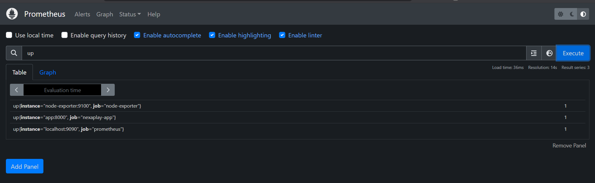

This single most important query returns  1 (healthy) or 0 (down) for every target. 

Froom the image all the three targets are reached, hence, 1 is returned for all the targets. The targets can also be reached on `http://localhost:9090/targets`.

To check the the total requests the app has handled, we run:

```promql
http_requests_total
```

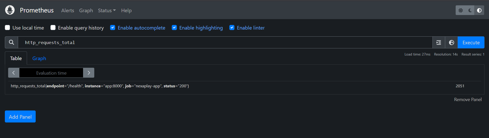

```promql
rate(http_requests_total[2m]) * 100
```

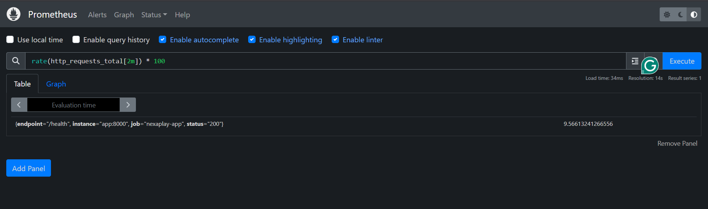

This shows throughput broken down by endpoint and status labels. Baseline for understanding normal traffic patterns before an incident happens.

Next, the number of players currently connected or playiing on the app can be determined:

```promql
nexaplay_active_players
```

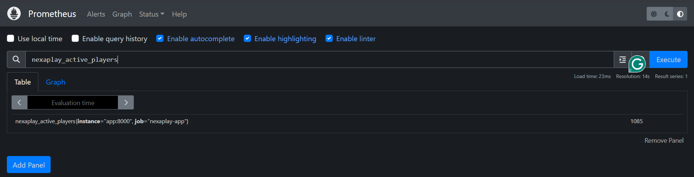

Over thouusand active players are currently playing. Is this number affecting memory usage? A query could answer this question:

```promql
process_resident_memory_bytes
```

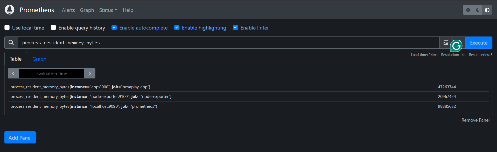

This returns the memory usage in bytes which can be hard to read. To make it more readable, we convert it to megabyte by dividing it by 1o24^2 (1024 / 1024):

```promql
process_resident_memory_bytes / 1024^2
```

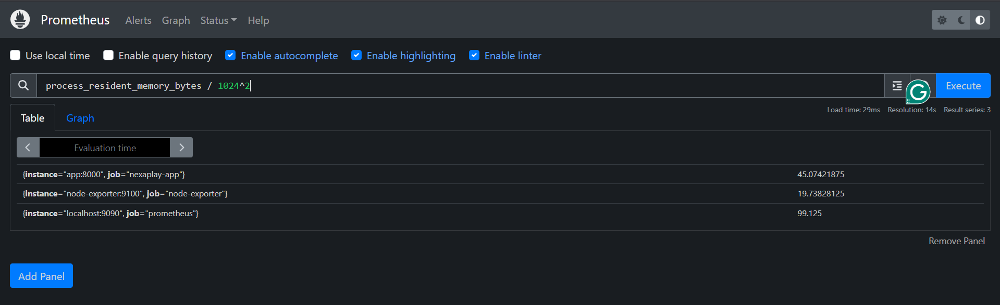

### Update Prometheus Scrape Interval

The cuurent configuration for the `scrape_interval`for the app target is `15s`. I will update it to `10s`. But before, let's confirm the current intervals:

**Get all scrape_intervals**:
  
```sh
curl -s http://localhost:9090/api/v1/status/config | jq -r '.data.yaml' | grep 'scrape_interval'
```

**Output**:

```sh
scrape_interval: 15s
scrape_interval: 15s
scrape_interval: 15s
scrape_interval: 15s
```

**Get scrape_intervals for only `nexaplay-app`**:
  
```sh
curl -s http://localhost:9090/api/v1/status/config | jq -r '.data.yaml' | yq '.scrape_configs[] | select(.job_name == "nexaplay-app") | .scrape_interval'
```

**Output**:

```sh
15s
```

We will `validate` before reloading:

```sh
promtool check config /path/to/prometheus.yml     # run if prometheus is locally installed.

                 or

docker exec -it nexaplay-prometheus promtool check config //etc//prometheus//prometheus.yml    # if running it on docker (use single / if running on unix system)
```

**Output**:

```sh
^[[FChecking //etc//prometheus//prometheus.yml
  SUCCESS: 1 rule files found
 SUCCESS: //etc//prometheus//prometheus.yml is valid prometheus config file syntax

Checking /etc/prometheus/rules/alerts.yml
  SUCCESS: 3 rules found
```

**Reload prometheus after modifying the scrape_interval to 10s for the app** by running:

```sh
curl -X POST localhost:9090/-/reload
```

**Reconfirm scrape interval for for all and app only**:

```sh
curl -s http://localhost:9090/api/v1/status/config | jq -r '.data.yaml' | grep 'scrape_interval'
```

**Output**:

```sh
scrape_interval: 15s
scrape_interval: 10s
scrape_interval: 15s
scrape_interval: 15s
```

```sh
curl -s http://localhost:9090/api/v1/status/config | jq -r '.data.yaml' | yq '.scrape_configs[] | select(.job_name == "nexaplay-app") | .scrape_interval'
```

**Output**:

```sh
10s
```

This is evident that the 10s scrape_interval for the app has been successfully configured. Verification from UI:

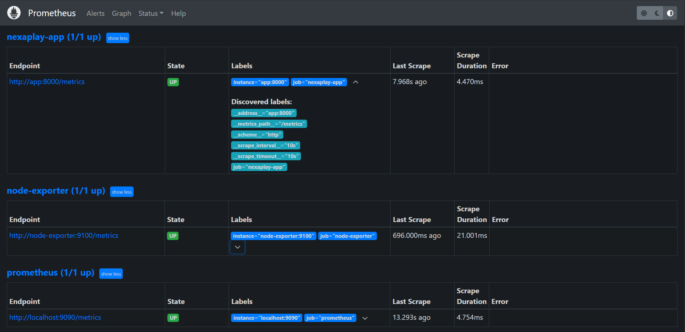

---

## Day 3: Build the Monitoring Dashboard

### Overview

The goal for Day 3 was to build a focused, four-panel Grafana dashboard that gives a real-time view of platform health — covering active players, request throughput, error rate, and CPU usage from Node Exporter.

The dashboard was defined as code in `grafana/dashboards/nexaplay-overview.json` and is automatically provisioned by Grafana on startup via `grafana/provisioning/dashboards/dashboard-provider.yml`. No manual clicking required — the dashboard appears as soon as the stack is running.

---

### Panel 1 — Active Players (Stat)

**Query:** `nexaplay_active_players`

A Stat panel showing the current number of active players on the platform. The value is sourced from the `nexaplay_active_players` Gauge metric, which is updated every 5 seconds by a background thread in `app/main.py`. During normal operation this fluctuates between 800–1200.

---

### Panel 2 — Request Rate per Second (Time Series)

**Query:** `rate(http_requests_total[1m])`

A Time Series panel showing the rolling per-second request rate across all endpoints and status codes. The `rate()` function calculates the average increase per second over the last 1 minute, smoothing out spikes. The dashboard time range is set to **Last 30 minutes** to keep the view focused on recent activity.

---

### Panel 3 — Error Rate % (Stat)

**Query:** `rate(http_requests_total{status=~"5.."}[1m]) / rate(http_requests_total[1m]) * 100`

A Stat panel showing the current error rate as a percentage of total traffic. The numerator filters for any 5xx status code using a regex label matcher. The panel will show **No data** when there are no errors — which is the expected behaviour under normal conditions. Errors only appear when the incident mode is triggered via `POST /admin/incident/start`.

Colour thresholds applied:

| Threshold | Colour |
|-----------|--------|
| Below 2%  | Green  |
| 2% – 5%   | Amber  |
| Above 5%  | Red    |

---

### Panel 4 — CPU Usage (Gauge)

**Query:** `100 - (avg(rate(node_cpu_seconds_total{job="node-exporter", mode="idle"}[1m])) * 100)`

A Gauge panel showing current CPU utilisation as a percentage, sourced exclusively from the `node-exporter` scrape target (`node-exporter:9100`). The `job="node-exporter"` label filter ensures the metric is not mixed with any other scrape target. Max value is set to 100.

---

### Dashboard Screenshot

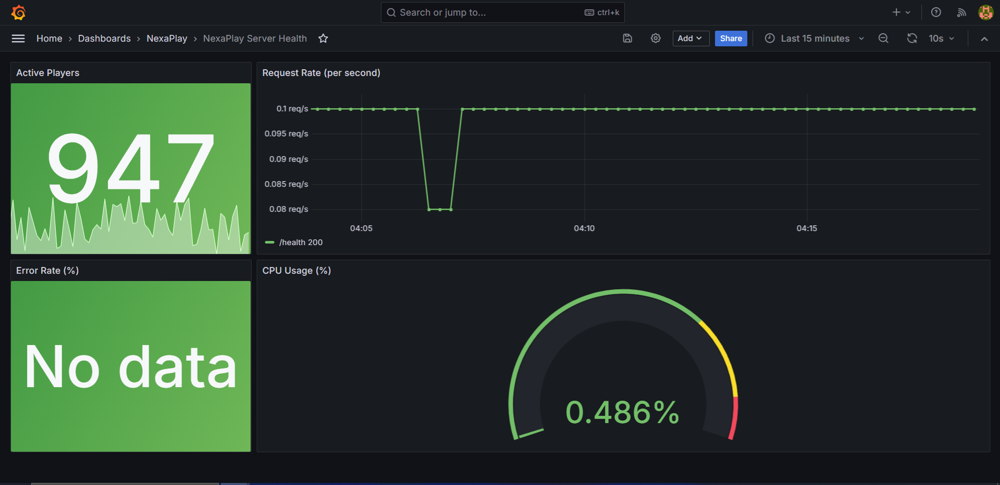

---

### Dashboard JSON

The finished dashboard was exported and saved to `grafana/dashboards/nexaplay-overview.json`. Below is a snapshot of the JSON structure:

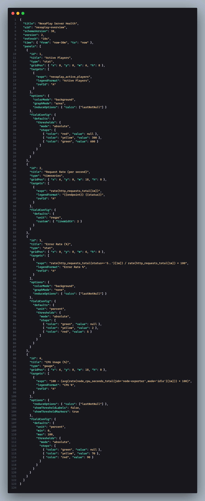

The file is version-controlled and automatically provisioned by Grafana on container startup — no manual import needed.

---

### Key Takeaways

- Grafana provisioning via JSON means the dashboard is reproducible and portable — anyone cloning the repo gets the same dashboard on `docker compose up`.
- The error rate panel correctly shows **No data** in a healthy system. This is intentional — the absence of 5xx series means no errors are occurring.
- Scoping the CPU query to `job="node-exporter"` is important in multi-job environments to avoid accidentally pulling metrics from the wrong scrape target.
- The `rate()` function is essential for Counter metrics like `http_requests_total` — querying the raw counter gives a monotonically increasing number, not a useful rate.

---

## Day 4: Alerting — ServiceDown & HighErrorRate

### Overview

The goal for Day 4 was to wire up end-to-end alerting: define alert rules in Prometheus, configure Alertmanager to forward notifications to a webhook receiver, and then test the full pipeline by deliberately stopping the app container and watching the alert travel from PENDING → FIRING → resolved.

---

### Alert Rules Defined (`prometheus/rules/alerts.yml`)

Two alert rules were written (the existing `HighMatchmakingLatency` rule was preserved):

#### 1. `ServiceDown`

```yaml
- alert: ServiceDown
  expr: up{job="nexaplay-app"} == 0
  for: 1m
  labels:
    severity: critical
  annotations:
    summary: "NexaPlay game server is DOWN"
    description: "The nexaplay-app target has been unreachable for more than 1 minute."
```

Fires when Prometheus cannot scrape the `nexaplay-app` target (`up == 0`). The `for: 1m` clause means the condition must hold for a full minute before the alert transitions from PENDING to FIRING — this prevents false positives from a single missed scrape.

#### 2. `HighErrorRate`

```yaml
- alert: HighErrorRate
  expr: >
    rate(http_requests_total{status=~"5.."}[1m])
    /
    rate(http_requests_total[1m])
    * 100 > 5
  for: 2m
  labels:
    severity: warning
  annotations:
    summary: "High 5xx error rate on NexaPlay"
    description: "5xx error rate has exceeded 5% of total requests for more than 2 minutes."
```

Fires when 5xx responses exceed 5% of total traffic for 2 consecutive minutes. The `status=~"5.."` regex matches any 500-level status code. The `for: 2m` window filters out brief error spikes.

---

### Alertmanager Webhook Configuration

The `alertmanager/alertmanager.yml.tmpl` was already configured to route all alerts to a webhook receiver using `${ALERTMANAGER_WEBHOOK_URL}` as a placeholder. The actual URL is stored in `.env` and injected at container startup via `envsubst` in the custom Alertmanager Dockerfile — no secrets in version control.

```yaml
receivers:
  - name: "webhook"
    webhook_configs:
      - url: "${ALERTMANAGER_WEBHOOK_URL}"
        send_resolved: true
```

The `send_resolved: true` flag means Alertmanager also sends a notification when the alert clears — important for confirming recovery.

The webhook URL was obtained from [webhook.site](https://webhook.site), which provides a unique, disposable URL that logs all incoming HTTP requests in real time.

**Validate the alerts.yml syntax by running promtool inside the Prometheus container**:

```sh
docker exec nexaplay-prometheus promtool check config //etc//prometheus//prometheus.yml
```

**Output**:

```sh
Checking //etc//prometheus//prometheus.yml
  SUCCESS: 1 rule files found
 SUCCESS: //etc//prometheus//prometheus.yml is valid prometheus config file syntax

Checking /etc/prometheus/rules/alerts.yml
  SUCCESS: 3 rules found
```

All looks good to test the alerts.

---

### Testing the ServiceDown Alert

**Step 1 — Stop the app container:**

```sh
docker compose stop app
```

**Step 2 — Watch Prometheus at `localhost:9090/alerts`:**

Within ~15 seconds the `ServiceDown` alert appeared in **PENDING** state (Prometheus detected `up == 0` but the `for: 1m` window had not elapsed yet).

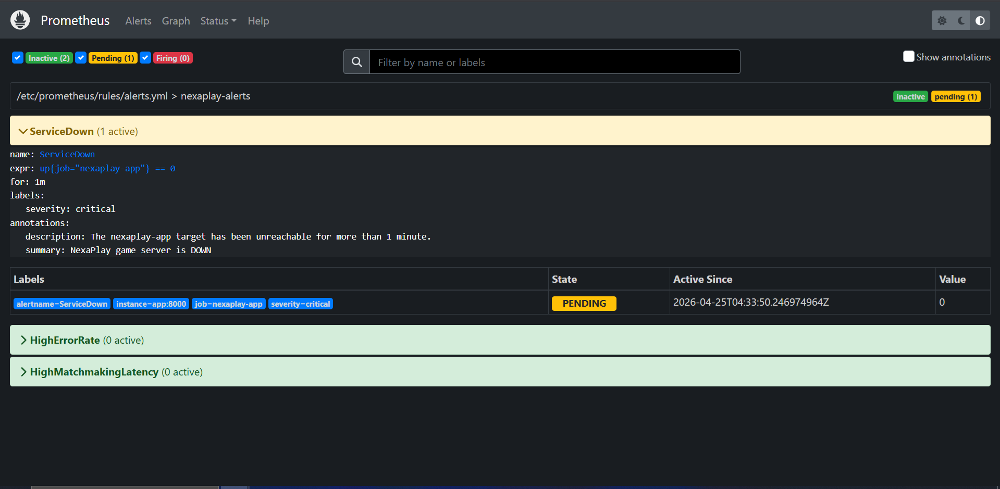

After approximately 1 minute the alert transitioned to **FIRING**. Prometheus then forwarded the alert to Alertmanager.

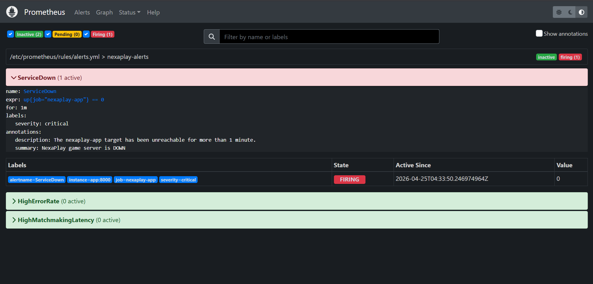

**Step 3 — Check webhook.site:**

The incoming alert notification arrived at the webhook URL. The payload was a standard Alertmanager JSON body containing:

- `status: "firing"`
- `labels`: `alertname: ServiceDown`, `severity: critical`, `job: nexaplay-app`
- `annotations`: summary and description as defined in the rule
- `startsAt` timestamp

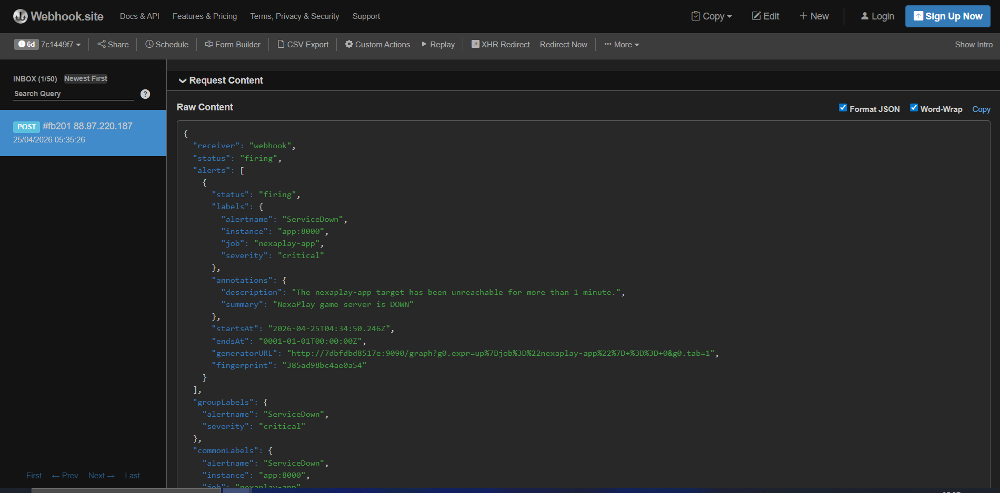

**Step 4 — Restore the service:**

```sh
docker compose start app
```

Within ~30 seconds Prometheus detected `up == 1` again. The `ServiceDown` alert moved back to **inactive** in the Prometheus UI. 

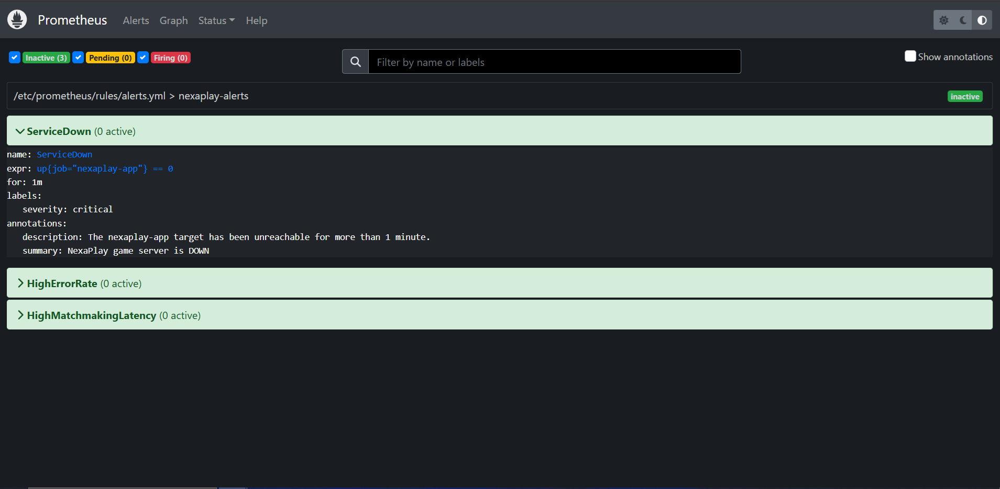

Alertmanager sent a second notification to webhook.site with `status: "resolved"` and a `endsAt` timestamp — confirming the recovery pipeline works end-to-end.

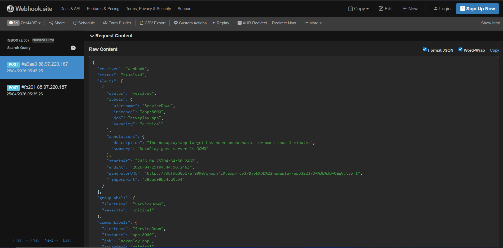

---

### Key Takeaways

- The `for` duration is critical: without it, a single missed scrape would immediately fire a critical alert. The 1-minute window gives the system time to recover from transient network blips before paging anyone.
- `send_resolved: true` is essential in production — without it you only know when things break, not when they recover.
- The `envsubst` pattern for Alertmanager config keeps secrets out of version control while still making the config fully reproducible. Any team member sets their own `ALERTMANAGER_WEBHOOK_URL` in `.env` and gets a working alerting pipeline with `docker compose up --build`.
- webhook.site is a fast, zero-setup way to validate the full alerting pipeline before connecting a real notification channel (PagerDuty, Slack, etc.).
- The PENDING → FIRING → resolved lifecycle in Prometheus maps directly to the firing → resolved notifications in Alertmanager — understanding this state machine is key to debugging alert delivery issues.

---

## Day 5: Week 1 Summary — The Full Stack in Plain English

### What Each Tool Does and How They Connect

The observability stack built this week has five moving parts. Here is what each one does and how they wire together.

**FastAPI app (`app/main.py`)** is the system being monitored. It exposes a `/metrics` endpoint that publishes four Prometheus-format metrics: a request counter, a latency histogram, an active-player gauge, and a matchmaking-queue gauge. Every other tool in the stack exists to consume what this endpoint produces.

**Prometheus** is the metrics engine. It runs a scrape loop — every 10 seconds for the app, every 15 seconds for everything else — pulling the `/metrics` endpoint from each target and storing the time-series data locally. It also evaluates the alert rules in `alerts.yml` on every scrape cycle. When a rule condition is met and holds for the required `for` duration, Prometheus changes the alert state from inactive → PENDING → FIRING and forwards the firing alert to Alertmanager. Prometheus does not send notifications itself — that is Alertmanager's job.

**Alertmanager** receives firing alerts from Prometheus and handles the notification routing. It groups related alerts, applies silences and inhibition rules, and dispatches notifications to configured receivers. In this stack the receiver is a webhook — Alertmanager sends an HTTP POST with a JSON payload to the configured URL whenever an alert fires or resolves. The `send_resolved: true` flag means recovery notifications are sent automatically, not just the initial fire.

**Node Exporter** is a sidecar that exposes host-level metrics — CPU, memory, disk, network — from the Docker host in Prometheus format. Prometheus scrapes it the same way it scrapes the app. This is what powers the CPU usage panel in Grafana without writing any custom instrumentation code.

**Grafana** is the visualisation layer. It connects to Prometheus as a datasource and renders the stored time-series data into dashboards. The dashboard in this project is defined as a JSON file and provisioned automatically on container startup — Grafana reads it from the mounted volume and makes it available without any manual import. Grafana never touches the app or Alertmanager directly; it only reads from Prometheus.

The data flow in one sentence: the **app** produces metrics → **Prometheus** scrapes and stores them → **Grafana** visualises them and **Alertmanager** acts on them when rules fire.

```
FastAPI app ──/metrics──► Prometheus ──PromQL──► Grafana (dashboards)
                               │
                          alert rules
                               │
                               ▼
                         Alertmanager ──POST──► webhook.site / PagerDuty / Slack
```

Node Exporter feeds into Prometheus alongside the app, contributing host metrics to the same data store.

---

### Most Confusing Part

The most confusing part was the **Alertmanager configuration and the `envsubst` templating pattern**.

Alertmanager expects a static YAML file at startup. But hardcoding a webhook URL into a config file that lives in version control is a bad practice — the URL is effectively a secret (anyone with it can receive your alert payloads). The solution was to use a `.tmpl` template file with a `${ALERTMANAGER_WEBHOOK_URL}` placeholder, and a custom Dockerfile that runs `envsubst` at container startup to render the real file before Alertmanager reads it.

The confusing part was that this is not a built-in Alertmanager feature — it required understanding three separate things at once: how Docker `ENTRYPOINT` works, how `envsubst` substitutes environment variables into files, and how to pass `.env` values through `docker-compose.yml` into the container environment. Getting the order of operations wrong (e.g. Alertmanager starting before `envsubst` finishes) would silently produce a broken config with a literal `${ALERTMANAGER_WEBHOOK_URL}` string as the URL.

Once the pattern clicked it felt clean and production-grade. But it took longer to reason through than any of the PromQL or Grafana work.

---

### Week 1 in One Paragraph

Week 1 went from zero to a fully operational observability stack: a FastAPI app instrumented with four custom metrics, Prometheus scraping and storing them, three alert rules covering service availability, error rate, and latency, Alertmanager routing notifications to a webhook with end-to-end delivery confirmed, and a four-panel Grafana dashboard provisioned as code. Every component is containerised, reproducible with a single `docker compose up --build`, and committed to GitHub. The stack is not just running — it is understood.
