# NexaPlay Observability & Monitoring Project — Daily Journal

This document contains daily accomplishments.

---

## Week One

## Day 1: Setting Up Tools

**What I did today:**

Tools including `Docker Desktop, Git, VS Code, Python 3.11, AWS CLI v2` were setup. These are confirmed by running the `powershell script` below:

```ps
.\check-versions.ps1
```

**Output**:

```sh
Docker Desktop: Docker version 29.4.0
Git: git version 2.52.0.windows.1
VS Code: 
Python: Python 3.13.12
AWS CLI v2: aws-cli/2.34.20 Python/3.14.3 Windows/11 exe/AMD64
```

Also, the following files were created as part of the requirements:

- `app/Dockerfile`: builds the FastAPI app on Python 3.11-slim.
- `docker-compose.yml`: all 5 services (app, prometheus, alertmanager, node-exporter, grafana) with health checks, named volumes, and env var wiring.
- `prometheus.yml`: scrapes app, node-exporter, and itself every 15s; points to Alertmanager
- `alerts.yml`: 3 rules: ServiceDown, HighErrorRate, HighMatchmakingLatency
- `alertmanager.yml.tmpl`: routes all alerts to webhook receiver; URL pulled from .env. I am using this template file to avoid hardcoding the `Webhook url`. Hence, using a custom `Dockerfile` for `Alertmanager` that's based on `Alpine`, which includes envsubst, and uses it as the entrypoint. Here's the setup:

1. alertmanager/Dockerfile — uses Alpine-based image that copies the Alertmanager binary from the official image, installs gettext (which provides envsubst), and uses it as the entrypoint to render the template before starting alertmanager.yml.tmpl.
2. the template with ${ALERTMANAGER_WEBHOOK_URL} as a real placeholder. Alertmanager now uses build: ./alertmanager and passes ALERTMANAGER_WEBHOOK_URL from .env as an environment variable. This makes it `dynamic and production grade`. This is because the `Webhook URL` lives in .env (one place), the template is version-controlled without secrets, and any team member cloning the repo just sets their own URL in .env and runs docker compose up --build — no manual editing of config files needed.

    > Note: running `docker compose up -d` for this set up might fail. The default build command is:

    ```sh
    docker compose up --build
    ```

    

    

- `prometheus.yml`: auto-wires Prometheus as default datasource
- `dashboard-provider.yml`: loads dashboards from the dashboards folder
- `nexaplay-overview.json`: 7 panels covering active players, matchmaking queue, request rate, error rate, response time (p50/p95), CPU, and memory

**Grafana** and **prometheus** are now accessible via localhost:3000 and localhost:9090 respectively.


AWS CLI configured, confirmed by running:

```sh
aws sts get-caller-identity
```

**Output**:

```sh
{
    "UserId": "MyUserID",
    "Account": "xxxxxxxxxxxxxxx",
    "Arn": "arn:aws:iam::xxxxxxxxxxxxxxx:user/myuser"
}
```

---

## Day 2: Setup Prometheus & Metrics

### Metrics defined in `app/main.py`

#### 1. `http_requests_total`

- **Type:** Counter
- **Labels:** `endpoint`, `status`
- **Measures:** The total number of HTTP requests received. Incremented on every route handler call via `.inc()`. Broken down by endpoint path (e.g. `/health`, `/player/login`) and HTTP status code (e.g. `200`, `500`). Because it's a Counter it only ever goes up, making it ideal for tracking cumulative request volume and deriving request rates with `rate()`.

#### 2. `nexaplay_active_players`

- **Type:** Gauge
- **Measures:** The number of players currently active on the platform. Set every 5 seconds by a background thread via `.set()`. During normal operation it fluctuates between 800–1200; during an incident it drops to 200–400, making it a direct signal of platform health.

#### 3. `http_request_duration_seconds`

- **Type:** Histogram
- **Labels:** `endpoint`
- **Measures:** How long each request takes to complete, in seconds. Recorded via `.observe(elapsed)` at the end of each route handler. As a Histogram it buckets observations automatically, enabling percentile queries (p50, p95, etc.) in Prometheus with `histogram_quantile()`.

#### 4. `nexaplay_matchmaking_queue`

- **Type:** Gauge
- **Measures:** The number of players currently waiting in the matchmaking queue. Also set every 5 seconds by the same background thread. Normal range is 10–40; during an incident it spikes to 80–150. A rising queue depth is an early warning sign of matchmaking degradation before errors start appearing.

### Access Prometheus UI and Run PromQL

Prometheus is accessible via `localhost:9090`. 


To be certain that Prometheus can reach all the scrape targets, the foolowing queries are run:

```promql
up
```


This single most important query returns  1 (healthy) or 0 (down) for every target. 

Froom the image all the three targets are reached, hence, 1 is returned for all the targets. The targets can also be reached on `http://localhost:9090/targets`.

To check the the total requests the app has handled, we run:

```promql
http_requests_total
```


```promql
rate(http_requests_total[2m]) * 100
```


This shows throughput broken down by endpoint and status labels. Baseline for understanding normal traffic patterns before an incident happens.

Next, the number of players currently connected or playiing on the app can be determined:

```promql
nexaplay_active_players
```


Over thouusand active players are currently playing. Is this number affecting memory usage? A query could answer this question:

```promql
process_resident_memory_bytes
```


This returns the memory usage in bytes which can be hard to read. To make it more readable, we convert it to megabyte by dividing it by 1o24^2 (1024 / 1024):

```promql
process_resident_memory_bytes / 1024^2
```


### Update Prometheus Scrape Interval

The cuurent configuration for the `scrape_interval`for the app target is `15s`. I will update it to `10s`. But before, let's confirm the current intervals:

**Get all scrape_intervals**:
  
```sh
curl -s http://localhost:9090/api/v1/status/config | jq -r '.data.yaml' | grep 'scrape_interval'
```

**Output**:

```sh
scrape_interval: 15s
scrape_interval: 15s
scrape_interval: 15s
scrape_interval: 15s
```

**Get scrape_intervals for only `nexaplay-app`**:
  
```sh
curl -s http://localhost:9090/api/v1/status/config | jq -r '.data.yaml' | yq '.scrape_configs[] | select(.job_name == "nexaplay-app") | .scrape_interval'
```

**Output**:

```sh
15s
```

We will `validate` before reloading:

```sh
promtool check config /path/to/prometheus.yml     # run if prometheus is locally installed.

                 or

docker exec -it nexaplay-prometheus promtool check config //etc//prometheus//prometheus.yml    # if running it on docker (use single / if running on unix system)
```

**Output**:

```sh
^[[FChecking //etc//prometheus//prometheus.yml
  SUCCESS: 1 rule files found
 SUCCESS: //etc//prometheus//prometheus.yml is valid prometheus config file syntax

Checking /etc/prometheus/rules/alerts.yml
  SUCCESS: 3 rules found
```

**Reload prometheus after modifying the scrape_interval to 10s for the app** by running:

```sh
curl -X POST localhost:9090/-/reload
```

**Reconfirm scrape interval for for all and app only**:

```sh
curl -s http://localhost:9090/api/v1/status/config | jq -r '.data.yaml' | grep 'scrape_interval'
```

**Output**:

```sh
scrape_interval: 15s
scrape_interval: 10s
scrape_interval: 15s
scrape_interval: 15s
```

```sh
curl -s http://localhost:9090/api/v1/status/config | jq -r '.data.yaml' | yq '.scrape_configs[] | select(.job_name == "nexaplay-app") | .scrape_interval'
```

**Output**:

```sh
10s
```

This is evident that the 10s scrape_interval for the app has been successfully configured. Verification from UI:


---

## Day 3: Build the Monitoring Dashboard

### Overview

The goal for Day 3 was to build a focused, four-panel Grafana dashboard that gives a real-time view of platform health — covering active players, request throughput, error rate, and CPU usage from Node Exporter.

The dashboard was defined as code in `grafana/dashboards/nexaplay-overview.json` and is automatically provisioned by Grafana on startup via `grafana/provisioning/dashboards/dashboard-provider.yml`. No manual clicking required — the dashboard appears as soon as the stack is running.

---

### Panel 1 — Active Players (Stat)

**Query:** `nexaplay_active_players`

A Stat panel showing the current number of active players on the platform. The value is sourced from the `nexaplay_active_players` Gauge metric, which is updated every 5 seconds by a background thread in `app/main.py`. During normal operation this fluctuates between 800–1200.

---

### Panel 2 — Request Rate per Second (Time Series)

**Query:** `rate(http_requests_total[1m])`

A Time Series panel showing the rolling per-second request rate across all endpoints and status codes. The `rate()` function calculates the average increase per second over the last 1 minute, smoothing out spikes. The dashboard time range is set to **Last 30 minutes** to keep the view focused on recent activity.

---

### Panel 3 — Error Rate % (Stat)

**Query:** `rate(http_requests_total{status=~"5.."}[1m]) / rate(http_requests_total[1m]) * 100`

A Stat panel showing the current error rate as a percentage of total traffic. The numerator filters for any 5xx status code using a regex label matcher. The panel will show **No data** when there are no errors — which is the expected behaviour under normal conditions. Errors only appear when the incident mode is triggered via `POST /admin/incident/start`.

Colour thresholds applied:

| Threshold | Colour |
|-----------|--------|
| Below 2%  | Green  |
| 2% – 5%   | Amber  |
| Above 5%  | Red    |

---

### Panel 4 — CPU Usage (Gauge)

**Query:** `100 - (avg(rate(node_cpu_seconds_total{job="node-exporter", mode="idle"}[1m])) * 100)`

A Gauge panel showing current CPU utilisation as a percentage, sourced exclusively from the `node-exporter` scrape target (`node-exporter:9100`). The `job="node-exporter"` label filter ensures the metric is not mixed with any other scrape target. Max value is set to 100.

---

### Dashboard Screenshot


---

### Dashboard JSON

The finished dashboard was exported and saved to `grafana/dashboards/nexaplay-overview.json`. Below is a snapshot of the JSON structure:


The file is version-controlled and automatically provisioned by Grafana on container startup — no manual import needed.

---

### Key Takeaways

- Grafana provisioning via JSON means the dashboard is reproducible and portable — anyone cloning the repo gets the same dashboard on `docker compose up`.
- The error rate panel correctly shows **No data** in a healthy system. This is intentional — the absence of 5xx series means no errors are occurring.
- Scoping the CPU query to `job="node-exporter"` is important in multi-job environments to avoid accidentally pulling metrics from the wrong scrape target.
- The `rate()` function is essential for Counter metrics like `http_requests_total` — querying the raw counter gives a monotonically increasing number, not a useful rate.

---

## Day 4: Alerting — ServiceDown & HighErrorRate

### Overview

The goal for Day 4 was to wire up end-to-end alerting: define alert rules in Prometheus, configure Alertmanager to forward notifications to a webhook receiver, and then test the full pipeline by deliberately stopping the app container and watching the alert travel from PENDING → FIRING → resolved.

---

### Alert Rules Defined (`prometheus/rules/alerts.yml`)

Two alert rules were written (the existing `HighMatchmakingLatency` rule was preserved):

#### 1. `ServiceDown`

```yaml
- alert: ServiceDown
  expr: up{job="nexaplay-app"} == 0
  for: 1m
  labels:
    severity: critical
  annotations:
    summary: "NexaPlay game server is DOWN"
    description: "The nexaplay-app target has been unreachable for more than 1 minute."
```

Fires when Prometheus cannot scrape the `nexaplay-app` target (`up == 0`). The `for: 1m` clause means the condition must hold for a full minute before the alert transitions from PENDING to FIRING — this prevents false positives from a single missed scrape.

#### 2. `HighErrorRate`

```yaml
- alert: HighErrorRate
  expr: >
    rate(http_requests_total{status=~"5.."}[1m])
    /
    rate(http_requests_total[1m])
    * 100 > 5
  for: 2m
  labels:
    severity: warning
  annotations:
    summary: "High 5xx error rate on NexaPlay"
    description: "5xx error rate has exceeded 5% of total requests for more than 2 minutes."
```

Fires when 5xx responses exceed 5% of total traffic for 2 consecutive minutes. The `status=~"5.."` regex matches any 500-level status code. The `for: 2m` window filters out brief error spikes.

---

### Alertmanager Webhook Configuration

The `alertmanager/alertmanager.yml.tmpl` was already configured to route all alerts to a webhook receiver using `${ALERTMANAGER_WEBHOOK_URL}` as a placeholder. The actual URL is stored in `.env` and injected at container startup via `envsubst` in the custom Alertmanager Dockerfile — no secrets in version control.

```yaml
receivers:
  - name: "webhook"
    webhook_configs:
      - url: "${ALERTMANAGER_WEBHOOK_URL}"
        send_resolved: true
```

The `send_resolved: true` flag means Alertmanager also sends a notification when the alert clears — important for confirming recovery.

The webhook URL was obtained from [webhook.site](https://webhook.site), which provides a unique, disposable URL that logs all incoming HTTP requests in real time.

**Validate the alerts.yml syntax by running promtool inside the Prometheus container**:

```sh
docker exec nexaplay-prometheus promtool check config //etc//prometheus//prometheus.yml
```

**Output**:

```sh
Checking //etc//prometheus//prometheus.yml
  SUCCESS: 1 rule files found
 SUCCESS: //etc//prometheus//prometheus.yml is valid prometheus config file syntax

Checking /etc/prometheus/rules/alerts.yml
  SUCCESS: 3 rules found
```

All looks good to test the alerts.

---

### Testing the ServiceDown Alert

**Step 1 — Stop the app container:**

```sh
docker compose stop app
```

**Step 2 — Watch Prometheus at `localhost:9090/alerts`:**

Within ~15 seconds the `ServiceDown` alert appeared in **PENDING** state (Prometheus detected `up == 0` but the `for: 1m` window had not elapsed yet).


After approximately 1 minute the alert transitioned to **FIRING**. Prometheus then forwarded the alert to Alertmanager.


**Step 3 — Check webhook.site:**

The incoming alert notification arrived at the webhook URL. The payload was a standard Alertmanager JSON body containing:

- `status: "firing"`
- `labels`: `alertname: ServiceDown`, `severity: critical`, `job: nexaplay-app`
- `annotations`: summary and description as defined in the rule
- `startsAt` timestamp


**Step 4 — Restore the service:**

```sh
docker compose start app
```

Within ~30 seconds Prometheus detected `up == 1` again. The `ServiceDown` alert moved back to **inactive** in the Prometheus UI. 


Alertmanager sent a second notification to webhook.site with `status: "resolved"` and a `endsAt` timestamp — confirming the recovery pipeline works end-to-end.


---

### Key Takeaways

- The `for` duration is critical: without it, a single missed scrape would immediately fire a critical alert. The 1-minute window gives the system time to recover from transient network blips before paging anyone.
- `send_resolved: true` is essential in production — without it you only know when things break, not when they recover.
- The `envsubst` pattern for Alertmanager config keeps secrets out of version control while still making the config fully reproducible. Any team member sets their own `ALERTMANAGER_WEBHOOK_URL` in `.env` and gets a working alerting pipeline with `docker compose up --build`.
- webhook.site is a fast, zero-setup way to validate the full alerting pipeline before connecting a real notification channel (PagerDuty, Slack, etc.).
- The PENDING → FIRING → resolved lifecycle in Prometheus maps directly to the firing → resolved notifications in Alertmanager — understanding this state machine is key to debugging alert delivery issues.

---

## Day 5: Week 1 Summary — The Full Stack in Plain English

### What Each Tool Does and How They Connect

The observability stack built this week has five moving parts. Here is what each one does and how they wire together.

**FastAPI app (`app/main.py`)** is the system being monitored. It exposes a `/metrics` endpoint that publishes four Prometheus-format metrics: a request counter, a latency histogram, an active-player gauge, and a matchmaking-queue gauge. Every other tool in the stack exists to consume what this endpoint produces.

**Prometheus** is the metrics engine. It runs a scrape loop — every 10 seconds for the app, every 15 seconds for everything else — pulling the `/metrics` endpoint from each target and storing the time-series data locally. It also evaluates the alert rules in `alerts.yml` on every scrape cycle. When a rule condition is met and holds for the required `for` duration, Prometheus changes the alert state from inactive → PENDING → FIRING and forwards the firing alert to Alertmanager. Prometheus does not send notifications itself — that is Alertmanager's job.

**Alertmanager** receives firing alerts from Prometheus and handles the notification routing. It groups related alerts, applies silences and inhibition rules, and dispatches notifications to configured receivers. In this stack the receiver is a webhook — Alertmanager sends an HTTP POST with a JSON payload to the configured URL whenever an alert fires or resolves. The `send_resolved: true` flag means recovery notifications are sent automatically, not just the initial fire.

**Node Exporter** is a sidecar that exposes host-level metrics — CPU, memory, disk, network — from the Docker host in Prometheus format. Prometheus scrapes it the same way it scrapes the app. This is what powers the CPU usage panel in Grafana without writing any custom instrumentation code.

**Grafana** is the visualisation layer. It connects to Prometheus as a datasource and renders the stored time-series data into dashboards. The dashboard in this project is defined as a JSON file and provisioned automatically on container startup — Grafana reads it from the mounted volume and makes it available without any manual import. Grafana never touches the app or Alertmanager directly; it only reads from Prometheus.

The data flow in one sentence: the **app** produces metrics → **Prometheus** scrapes and stores them → **Grafana** visualises them and **Alertmanager** acts on them when rules fire.

```sh
FastAPI app ──/metrics──► Prometheus ──PromQL──► Grafana (dashboards)
                               │
                          alert rules
                               │
                               ▼
                         Alertmanager ──POST──► webhook.site / PagerDuty / Slack
```

Node Exporter feeds into Prometheus alongside the app, contributing host metrics to the same data store.

---

### Most Confusing Part

The most confusing part was the **Alertmanager configuration and the `envsubst` templating pattern**.

Alertmanager expects a static YAML file at startup. But hardcoding a webhook URL into a config file that lives in version control is a bad practice — the URL is effectively a secret (anyone with it can receive your alert payloads). The solution was to use a `.tmpl` template file with a `${ALERTMANAGER_WEBHOOK_URL}` placeholder, and a custom Dockerfile that runs `envsubst` at container startup to render the real file before Alertmanager reads it.

The confusing part was that this is not a built-in Alertmanager feature — it required understanding three separate things at once: how Docker `ENTRYPOINT` works, how `envsubst` substitutes environment variables into files, and how to pass `.env` values through `docker-compose.yml` into the container environment. Getting the order of operations wrong (e.g. Alertmanager starting before `envsubst` finishes) would silently produce a broken config with a literal `${ALERTMANAGER_WEBHOOK_URL}` string as the URL.

Once the pattern clicked it felt clean and production-grade. But it took longer to reason through than any of the PromQL or Grafana work.

---

### Week 1 in One Paragraph

Week 1 went from zero to a fully operational observability stack: a FastAPI app instrumented with four custom metrics, Prometheus scraping and storing them, three alert rules covering service availability, error rate, and latency, Alertmanager routing notifications to a webhook with end-to-end delivery confirmed, and a four-panel Grafana dashboard provisioned as code. Every component is containerised, reproducible with a single `docker compose up --build`, and committed to GitHub. The stack is not just running — it is understood.

## Week two

## Day 1: Review and Add a Fifth Panel to the Grafana Dashboard

### Overview

The goal for Day 1 of Week 2 was to review the existing incident report and understand what to monitor to help document the incident. Review the four-panel Grafana dashboard, add a fifth panel showing memory usage over the last hour, re-test the `ServiceDown` alert from a clean restart, and draft a runbook entry.

---

### Clean Restart Verification

Before making any changes, the full stack was brought down and back up from scratch to confirm everything still works:

```sh
docker compose down
```

```sh
[+] down 6/6
 ✔ Container nexaplay-alertmanager                  Removed                                                         0.6s
 ✔ Container nexaplay-node-exporter                 Removed                                                         0.8s
 ✔ Container nexaplay-grafana                       Removed                                                         0.6s
 ✔ Container nexaplay-prometheus                    Removed                                                         0.5s
 ✔ Container nexaplay-app                           Removed                                                         0.7s
 ✔ Network observability_monitoring_project_default Removed                                                         0.2s
 ```

```sh
docker compose up --build -d
```

```sh
[+] up 8/8
 ✔ Image observability_monitoring_project-alertmanager Built                                                                                       2.4s
 ✔ Image observability_monitoring_project-app          Built                                                                                       2.4s
 ✔ Network observability_monitoring_project_default    Created                                                                                     0.0s
 ✔ Container nexaplay-app                              Started                                                                                     0.5s
 ✔ Container nexaplay-node-exporter                    Started                                                                                     0.7s
 ✔ Container nexaplay-alertmanager                     Started                                                                                     0.7s
 ✔ Container nexaplay-prometheus                       Started                                                                                     0.7s
 ✔ Container nexaplay-grafana                          Started                                                                                     0.9s
```

All five services came up healthy:

```sh
docker compose ps
```

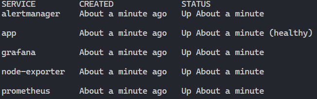

Confirmed:
- `http://localhost:9090/targets` — all three targets (`nexaplay-app`, `node-exporter`, `prometheus`) showing **UP**


- `http://localhost:3000` — Grafana dashboard loading with all four panels populated

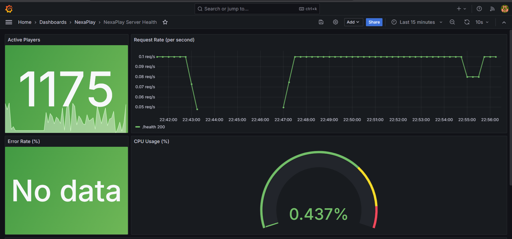

- `http://localhost:9090/alerts` — all alerts in **inactive** state (healthy baseline)

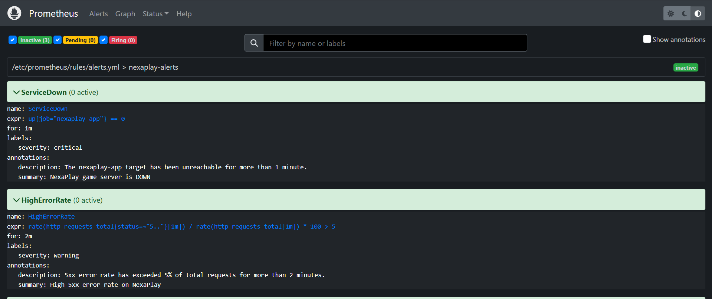

---

### Fifth Panel — Memory Usage (MB)

A fifth panel was added to `grafana/dashboards/nexaplay-overview.json`:

- **Type:** Time Series
- **Title:** Memory Usage (MB) — Last Hour
- **Query:** `process_resident_memory_bytes{job='nexaplay-app'} / 1024 / 1024`
- **Unit:** `megabytes` (Grafana built-in unit, displays as MB)
- **Time override:** `timeFrom: 1h` — shows the last hour regardless of the dashboard's global time range
- **Grid position:** full-width row below the existing four panels (`y: 16, w: 24, h: 8`)

The query divides the raw byte value by 1024 twice to convert bytes → kilobytes → megabytes. The `job='nexaplay-app'` label filter scopes the metric to the FastAPI app only, excluding any other processes that might expose the same metric name.

This panel is directly relevant to an incident scenario: a memory leak or spike during high load will be visible here before it causes a crash.

**Check if `grafana dashboard json` is valid**:

```pwsh
Get-Content grafana/dashboards/nexaplay-overview.json | python -m json.tool --no-ensure-ascii > $null && Write-Host "JSON valid" || Write-Host "JSON invalid"
```

**Output**:

```pwsh
JSON valid
```

```py
python -m json.tool grafana/dashboards/nexaplay-overview.json > /dev/null && echo "JSON valid" || echo "JSON invalid"
```

**Output**

```py
JSON valid
```

**Fifth dashboard**:

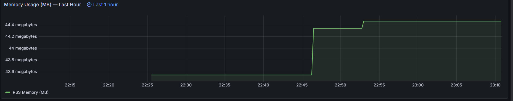

---

### ServiceDown Alert — Re-test

The `ServiceDown` alert was re-tested against the freshly restarted stack:

**Step 1 — Stop the app:**

```sh
docker compose stop app
```

**Step 2 — Watch Prometheus:**

Within ~15 seconds the alert appeared in **PENDING** state. After 1 minute it transitioned to **FIRING** and Alertmanager forwarded the payload to the webhook.

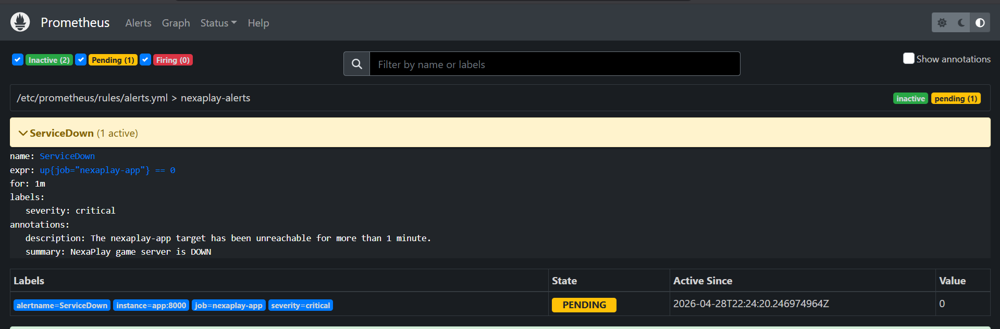
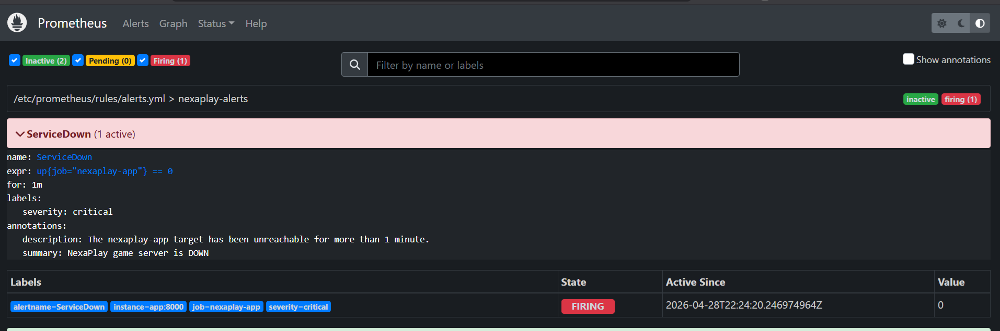

**Step 3 — Restore the app:**

```sh
docker compose start app
```

Within ~30 seconds the alert returned to **inactive** and Alertmanager sent a `resolved` notification. End-to-end pipeline confirmed working on the clean restart.

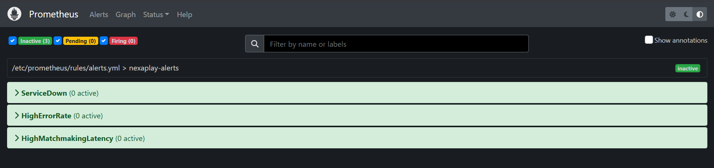
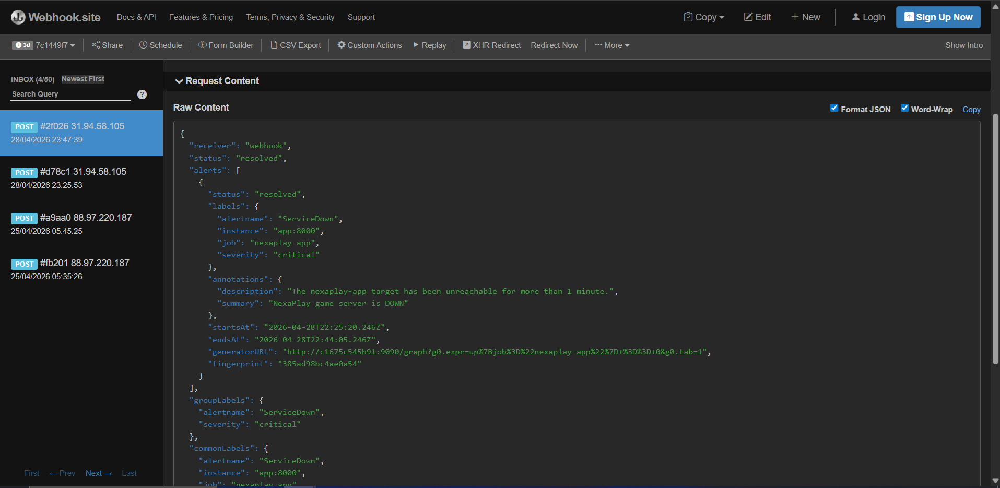

---

### Runbook

A `runbook.md` file was created at the project root. It covers all three alert rules (`ServiceDown`, `HighErrorRate`, `HighMatchmakingLatency`) in plain language — written for someone who has never seen the stack before.

The `ServiceDown` entry explains:
- What the alert means (Prometheus cannot reach the app for > 1 minute)
- What to check first (`docker compose ps`, then `docker compose logs --tail=50 app`)
- How to restore the service (`docker compose start app` for a simple restart, `docker compose down && docker compose up --build -d` for a full clean restart)
- A table of common crash causes and their fixes
- How to confirm recovery (Prometheus targets, alert state, Grafana dashboard)

---

### Key Takeaways

- A clean restart is the fastest way to confirm the stack is reproducible — if it breaks on a fresh `docker compose up --build`, something is wrong with the config, not just the running state.
- The memory panel uses `/ 1024 / 1024` rather than `/ 1024^2` because PromQL operator precedence with `^` can behave unexpectedly in some Grafana versions; the explicit two-step division is unambiguous.
- The `timeFrom` override on the memory panel lets it show a full hour of history even when the dashboard global range is set to 30 minutes — useful for spotting slow memory trends that would be invisible in a shorter window.
- Writing the runbook forced a clear articulation of the recovery steps, which surfaced a gap: the runbook now documents the `OOMKilled` scenario, which is exactly the kind of failure the memory panel is designed to catch early.

---

## Day 2: Operation Server Meltdown — Incident Simulation

### Overview

The goal for Day 2 of Week 2 was to run the full incident simulation end-to-end: establish a healthy baseline with the load generator, trigger the incident, investigate using only the Grafana dashboard and Prometheus (no logs, no SSH), resolve it, and write the incident report while the details were fresh.

---

### Step 1 — Healthy Baseline

The load generator was started first:

```sh
python scripts/load_generator.py
```

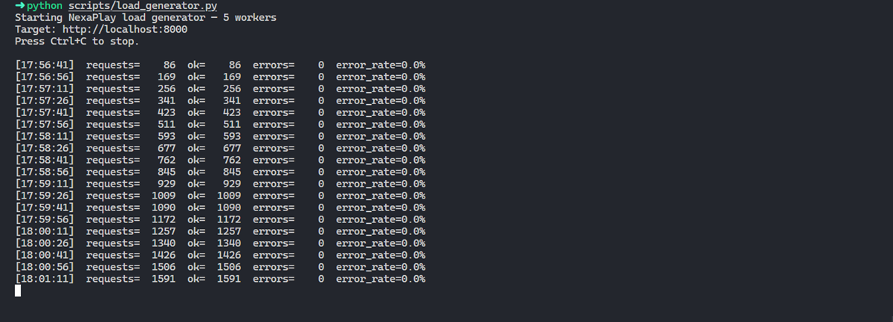

Five worker threads began hitting `/health`, `/player/login`, `/matchmaking/find`, and `/game/session` with weighted traffic (40% matchmaking, 25% game sessions, 20% health, 15% logins). After ~5 minutes of warm-up the dashboard showed a stable baseline:

| Panel | Baseline reading |
|---|---|
| Active Players | ~1,003 (green) |
| Request Rate | ~2.5 req/s across all endpoints, all 200-status |
| Error Rate | No data (0% errors) |
| CPU Usage | ~0.696% |
| Memory Usage | ~45.15–45.2 MB |

The load generator terminal confirmed zero errors across 1,500+ requests:

```
[18:01:11]  requests=  1591  ok=  1591  errors=  0  error_rate=0.0%
```

---

### Step 2 — Incident Triggered

```sh
curl -X POST http://localhost:8000/admin/incident/start
```

**Output:**

```json
{"message":"Incident started. Matchmaking is now degraded."}
```

**Trigger time: 18:08**

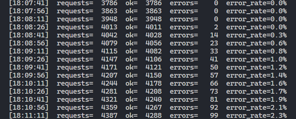

---

### Step 3 — Dashboard Observation (Investigation)

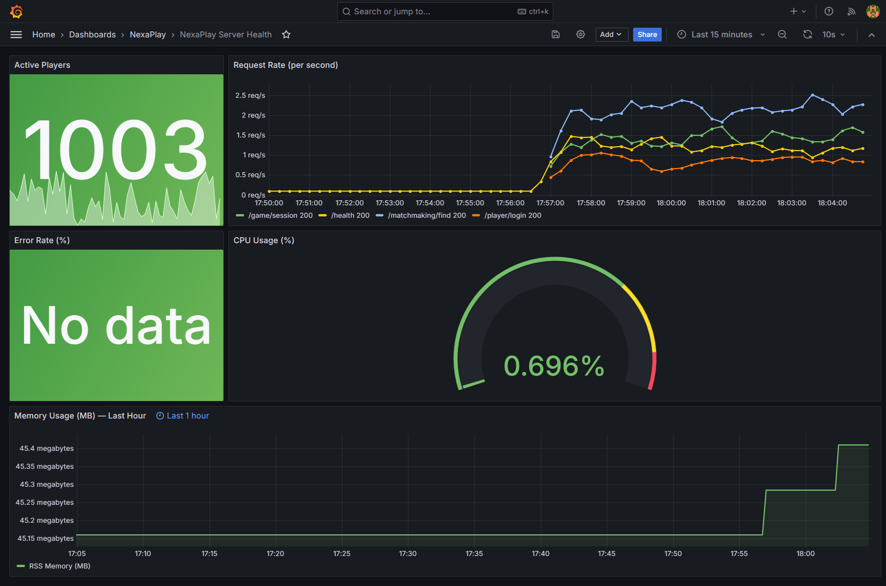

Within ~2 minutes of triggering, the dashboard changed dramatically:

**Active Players** dropped from 1,003 (green) to **240** (red) — below the 300 threshold, triggering the red background. The simulation thread had switched to the incident range (200–400).

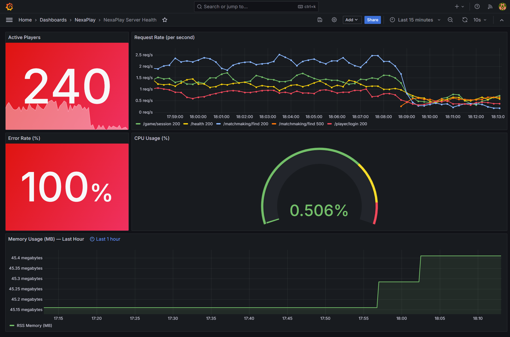
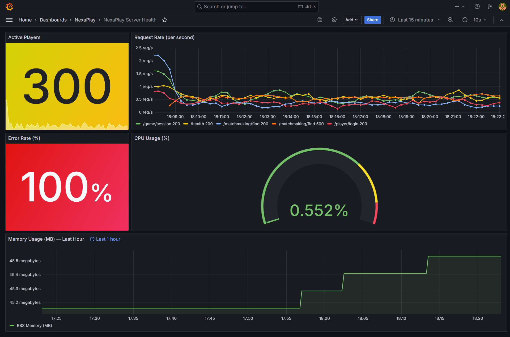

**Error Rate** jumped from "No data" to **100%** (red). Every matchmaking request was returning a 500. This was the most alarming panel — a complete failure of the matchmaking endpoint, not a partial degradation.

**Request Rate** showed a new series in the legend: `/matchmaking/find 500`. The overall throughput across all endpoints began declining as the 5 load generator workers backed up waiting for slow matchmaking responses (2–5 seconds each vs. the normal 100–300 ms). By 18:12 the total rate had dropped noticeably.

**CPU Usage** stayed at ~0.5–0.55% throughout. The host was not under load — this was an application-level failure, not a resource exhaustion.

**Memory Usage** stepped up slightly from ~45.2 MB to ~45.3–45.5 MB. The increase was small and stable — no runaway growth, ruling out a memory leak.

The load generator terminal showed errors beginning at `[18:08:26]` and climbing steadily:

```
[18:08:26]  requests=  4013  ok=  4011  errors=   2  error_rate=0.0%
[18:09:11]  requests=  4115  ok=  4082  errors=  33  error_rate=0.8%
[18:10:11]  requests=  4244  ok=  4178  errors=  66  error_rate=1.6%
[18:11:11]  requests=  4387  ok=  4288  errors=  99  error_rate=2.3%
```

The cumulative error rate in the terminal appeared low (2.3%) because it averaged across the entire session including the clean baseline period. The Grafana panel showed 100% because it used `rate()` over the last 1 minute — only the current window, where every matchmaking request was failing.

---

### Step 4 — Prometheus Alert

The `HighErrorRate` alert fired. The rule requires >5% error rate for 2 consecutive minutes. Given errors started at 18:08:26, the alert entered PENDING state almost immediately and transitioned to FIRING at approximately **18:10–18:11** — about **2–3 minutes** after the incident started.

The alert was delivered to webhook.site as a JSON POST:

- `status: "firing"`
- `alertname: HighErrorRate`
- `severity: warning`
- `annotations.summary: "High 5xx error rate on NexaPlay"`

---

### Step 5 — Resolution

```sh
docker compose restart app
```

Recovery confirmed on the dashboard within ~30 seconds:

- Active Players: back to **881** (green)
- Error Rate: back to **No data**
- Request Rate: `/matchmaking/find 500` series gone; only 200-status series visible
- Memory: stabilised at ~45.1 MB

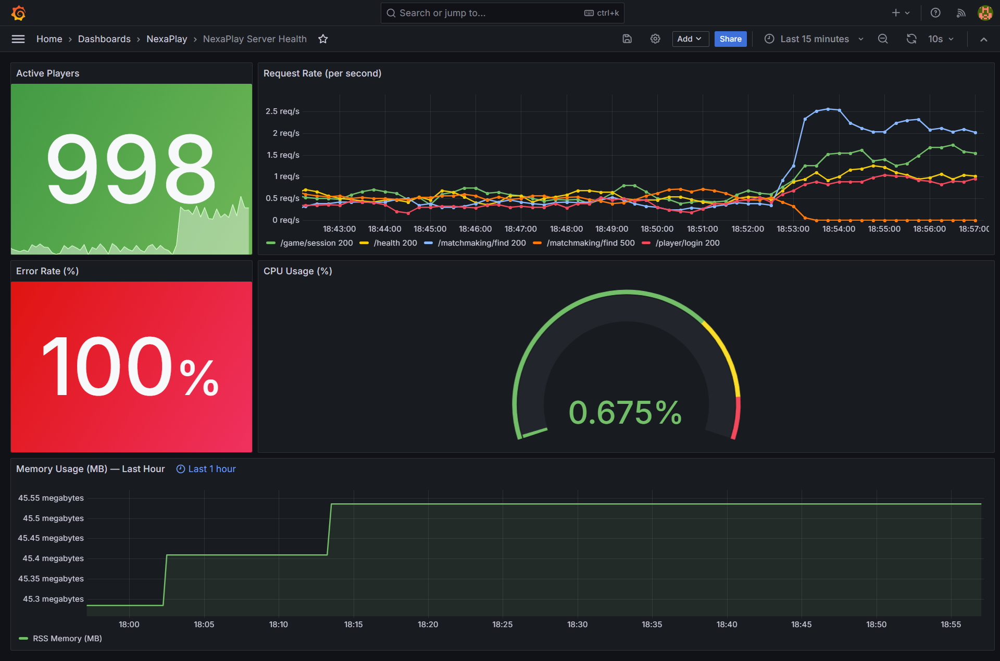
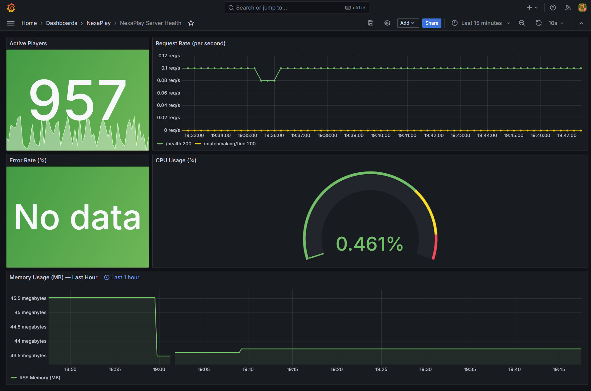

Alertmanager sent a `status: "resolved"` notification to webhook.site confirming the alert cleared end-to-end.

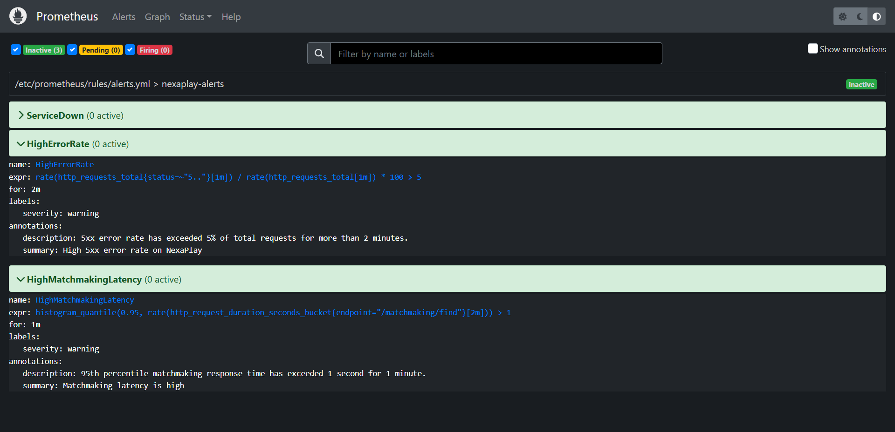

---

### Step 6 — Incident Report

The full incident report was written and saved to `incident-report.md` at the project root. It follows the template from Section 7.3 of the project brief and covers:

- What happened and what players experienced
- How the alert was detected and which panel showed it first
- Investigation findings with specific metric readings
- The fix command and how recovery was confirmed
- One prevention measure: a circuit breaker on the matchmaking service

---

### Key Takeaways

- The **Error Rate panel** was the most decisive signal — jumping from "No data" to 100% in under a minute. The Active Players drop was a secondary confirmation.
- **CPU and memory were red herrings** in this incident. Both stayed normal throughout. Without the error rate and request rate panels, you might have spent time looking for a resource problem that did not exist.
- The **cumulative error rate in the load generator terminal was misleading** (2.3%) compared to the Grafana panel (100%). This is why `rate()` over a short window is more useful for incident detection than a running total — it shows what is happening *now*, not what happened on average over the whole session.
- The `HighErrorRate` alert fired ~2–3 minutes after the incident started. In a real tournament with 12,000 players, that is 2–3 minutes of players hitting errors before anyone is paged. A shorter `for` duration (e.g. 30s instead of 2m) would reduce detection time at the cost of more false positives from brief spikes.
- The **memory panel proved its value** even though memory was not the cause — it ruled out a memory leak quickly, narrowing the investigation to application logic rather than infrastructure.

---

## Day 3: Cloud Export to AWS S3 Bucket & CI Validation

### Overview

The goal for Day 3 was to back up the Grafana dashboard to S3 using a least-privilege IAM user, write an export script, and set up a GitHub Actions workflow that validates the core config files on every push.

---

### Step 1 — S3 Bucket

Created the bucket using the AWS CLI only (no console):

```bash
aws s3api create-bucket --bucket j0nes-osei-nexaplay-dashboards --region us-east-1
```

**Output:**

```json
{
    "Location": "/j0nes-osei-nexaplay-dashboards",
    "BucketArn": "arn:aws:s3:::j0nes-osei-nexaplay-dashboards"
}
```

---

### Step 2 — IAM User and Least-Privilege Policy

Created a dedicated IAM user for the export script:

```bash
aws iam create-user --user-name nexaplay-dashboard-exporter
```

Wrote a targeted policy (`scripts/iam-policy.json`) that allows **only** `s3:PutObject` on the specific bucket — no `ListBucket`, no `GetObject`, no wildcard:

```json
{
  "Version": "2012-10-17",
  "Statement": [
    {
      "Sid": "AllowDashboardUploadOnly",
      "Effect": "Allow",
      "Action": "s3:PutObject",
      "Resource": "arn:aws:s3:::j0nes-osei-nexaplay-dashboards/*"
    }
  ]
}
```

Created and attached the policy:

```bash
aws iam create-policy \
  --policy-name nexaplay-s3-putobject-only \
  --policy-document file://scripts/iam-policy.json

aws iam attach-user-policy \
  --user-name nexaplay-dashboard-exporter \
  --policy-arn arn:aws:iam::241893993378:policy/nexaplay-s3-putobject-only
```

Confirmed attachment:

```bash
aws iam list-attached-user-policies --user-name nexaplay-dashboard-exporter
```

**Output:**

```json
{
    "AttachedPolicies": [
        {
            "PolicyName": "nexaplay-s3-putobject-only",
            "PolicyArn": "arn:aws:iam::241893993378:policy/nexaplay-s3-putobject-only"
        }
    ]
}
```

Generated access keys and saved them to `.env` (not committed):

```bash
aws iam create-access-key --user-name nexaplay-dashboard-exporter
```

`.env` updated with:

```
AWS_ACCESS_KEY_ID=<key id>
AWS_SECRET_ACCESS_KEY=<secret>
AWS_REGION=us-east-1
S3_BUCKET_NAME=j0nes-osei-nexaplay-dashboards
```

Confirmed `.env` is in `.gitignore` and does not appear in `git status` as a staged file.

---

### Step 3 — Export Script (`scripts/export_to_s3.py`)

Wrote `scripts/export_to_s3.py` using `boto3`. The script:

1. Reads credentials and bucket name from environment variables (via `.env`)
2. Validates the dashboard JSON is well-formed before uploading
3. Uploads `grafana/dashboards/nexaplay-overview.json` to `s3://j0nes-osei-nexaplay-dashboards/dashboards/nexaplay-overview.json`
4. Sets `ContentType: application/json` on the object

Run:

```bash
python scripts/export_to_s3.py
```

**Output:**

```
=== NexaPlay Dashboard Exporter ===
[INFO] Uploading nexaplay-overview.json → s3://j0nes-osei-nexaplay-dashboards/dashboards/nexaplay-overview.json
[OK]   Upload complete.
       Verify with: aws s3 ls s3://j0nes-osei-nexaplay-dashboards/dashboards/
```

Verified the file is in S3:

```bash
aws s3 ls s3://j0nes-osei-nexaplay-dashboards/dashboards/
```

**Output:**

```
2026-05-10 20:16:49       4273 nexaplay-overview.json
```

---

### Step 4 — GitHub Actions Workflow (`.github/workflows/validate.yml`)

Wrote a workflow that runs on every push to any branch and validates four things:

| Step | What it checks |
|---|---|
| Verify Docker Compose is available | `docker compose version` — confirms the runner has Compose |
| Validate docker-compose.yml syntax | `docker compose -f docker-compose.yml config --quiet` |
| Validate prometheus.yml with promtool | Runs `promtool check config` inside the Prometheus container |
| Validate alert rules with promtool | Runs `promtool check rules` on `alerts.yml` |
| Validate Grafana dashboard JSON | `python3 -m json.tool` — confirms valid JSON |

**Two fixes were needed before the workflow passed:**

1. The original step tried to install `docker-compose-plugin` via `apt-get`. On `ubuntu-latest`, Docker Compose is already present as `docker compose` (the v2 plugin) — the package name is not available in the default apt sources. Fix: removed the install step entirely and added a `docker compose version` check instead.

2. The `promtool` steps failed because the Prometheus image's default entrypoint is the `prometheus` binary, not `promtool`. Running `docker run prom/prometheus:v2.51.2 promtool check config ...` passed `promtool` as an argument to the prometheus entrypoint, which ignored it. Fix: added `--entrypoint /bin/promtool` to both `docker run` commands so the container runs `promtool` directly.

Final workflow run: **all 7 steps green** in 12 seconds (run #3).

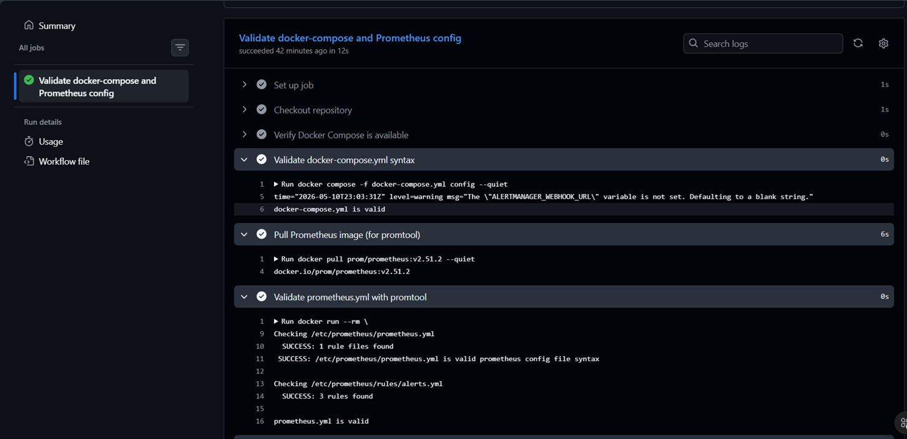
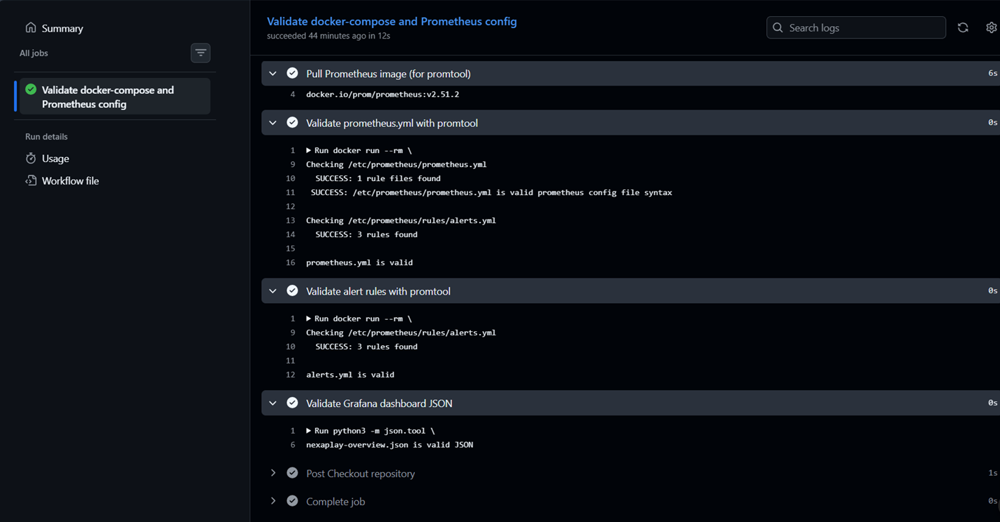

---

### Key Takeaways

- `aws s3 ls` returning empty output on a new bucket is correct — it means the bucket exists and is accessible. An error would mean the bucket doesn't exist or credentials are wrong.
- The IAM policy uses `Resource: arn:aws:s3:::j0nes-osei-nexaplay-dashboards/*` (with the `/*` suffix) because `s3:PutObject` operates on objects, not the bucket itself. Without the `/*` the policy would silently fail to match any real upload.
- `AmazonS3FullAccess` would give the export user the ability to read, delete, and list every object in every bucket in the account. The targeted policy limits the blast radius to a single write operation on a single bucket — if the key is ever leaked, the attacker can only overwrite dashboard JSON files.
- GitHub Actions `ubuntu-latest` runners come with Docker and Docker Compose v2 pre-installed. There is no need to install either — just verify they are present with a version check.
- The `--entrypoint` flag is the correct way to run a non-default binary from a Docker image. The Prometheus image ships both `prometheus` and `promtool` at `/bin/` — the entrypoint just determines which one runs when you call `docker run`.

---

## Day 4: Cleanup, Security Check & Final Reflection

### Overview

The goal for Day 4 was to finalise the runbook, run a security audit, tear down all AWS resources, confirm the local stack still works from a clean restart, and write the individual reflection.

---

### Runbook Finalised

`runbook.md` was rewritten to the final standard. All three alert entries (`ServiceDown`, `HighErrorRate`, `HighMatchmakingLatency`) now include:

- What the alert means (plain language, no assumed knowledge)
- What to check first (ordered steps with exact commands)
- Common causes (table format: symptom → cause → fix)
- How to resolve (specific commands for each scenario)
- How to confirm recovery (exact signals to look for in Grafana, Prometheus, and Alertmanager)

---

### Security Check

**1. Scan git history for committed AWS keys:**

```bash
git log --all -S 'AKIA'
```

**Output:** No commits returned. No AWS access key IDs have ever been committed to the repository.

**2. Confirm `.env` is in `.gitignore`:**

```bash
cat .gitignore | grep .env
```

**Output:** `.env` — confirmed listed.

```bash
git check-ignore -v .env
```

**Output:** `.gitignore:1:.env` — git will never stage this file.

**3. IAM policy review:**

The `nexaplay-s3-putobject-only` policy grants exactly one permission:

```json
{
  "Action": "s3:PutObject",
  "Resource": "arn:aws:s3:::j0nes-osei-nexaplay-dashboards/*"
}
```

No `s3:GetObject`, no `s3:DeleteObject`, no `s3:ListBucket`, no wildcard resource. If the access key were leaked, an attacker could only overwrite files in this one bucket — they could not read, list, or delete anything.

---

### AWS Resource Cleanup

All resources deleted in the correct order (objects before bucket, keys before user):

**Delete S3 bucket contents:**

```bash
aws s3 rm s3://j0nes-osei-nexaplay-dashboards/ --recursive
```

**Delete the bucket:**

```bash
aws s3api delete-bucket --bucket j0nes-osei-nexaplay-dashboards
```

confirmed s3 bucket deletion by running `aws s3 ls s3://j0nes-osei-nexaplay-dashboards/dashboards/` which returned nothing.

**List and delete the IAM access key:**

```bash
aws iam list-access-keys --user-name nexaplay-dashboard-exporter
```

```bash
{
    "AccessKeyMetadata": [
        {
            "UserName": "nexaplay-dashboard-exporter",
            "AccessKeyId": "xxxxxxxxxxxxxxxxxxxxxx",
            "Status": "Active",
            "CreateDate": "2026-05-10T19:06:05+00:00"
        }
    ]
}
```

Now delete it:

```bash
aws iam delete-access-key \
  --user-name nexaplay-dashboard-exporter \
  --access-key-id xxxxxxxxxxxxxxxxxxxxxxx
```

confirm IAM deletion:

```bash
aws iam list-access-keys --user-name nexaplay-dashboard-exporter
```

**Output**:

```bash
{
    "AccessKeyMetadata": []
}
```

**Detach the policy:**

```bash
aws iam detach-user-policy \
  --user-name nexaplay-dashboard-exporter \
  --policy-arn arn:aws:iam::241893993378:policy/nexaplay-s3-putobject-only
```

**Delete the policy:**

```bash
aws iam delete-policy \
  --policy-arn arn:aws:iam::241893993378:policy/nexaplay-s3-putobject-only
```

**Delete the IAM user:**

```bash
aws iam delete-user --user-name nexaplay-dashboard-exporter
```

**Confirm nothing remains:**

```bash
aws s3 ls | grep nexaplay
aws iam get-user --user-name nexaplay-dashboard-exporter
```

```
aws: [ERROR]: An error occurred (NoSuchEntity) when calling the GetUser operation: The user with name nexaplay-dashboard-exporter cannot be found.

Additional error details:
Type: Sender
```

---

### Final Stack Restart

```bash
docker compose down -v
```

```bash
[+] down 8/8
 ✔ Container nexaplay-alertmanager                         Removed                                                                                                          0.6s
 ✔ Container nexaplay-node-exporter                        Removed                                                                                                          0.8s
 ✔ Container nexaplay-grafana                              Removed                                                                                                          0.5s
 ✔ Container nexaplay-prometheus                           Removed                                                                                                          0.5s
 ✔ Container nexaplay-app                                  Removed                                                                                                          0.7s
 ✔ Volume observability_monitoring_project_grafana-data    Removed                                                                                                          0.0s
 ✔ Volume observability_monitoring_project_prometheus-data Removed                                                                                                          0.0s
 ✔ Network observability_monitoring_project_default        Removed                                                                                                          0.3s
 ```


The `-v` flag removes named volumes (`prometheus-data`, `grafana-data`), giving a truly clean state — no cached metrics, no saved dashboard state. After ~60 seconds:

Test if app will still work:

```bash
docker compose up -d
```

```bash
#27 DONE 0.0s
[+] up 10/10
 ✔ Image observability_monitoring_project-app              Built                                                                                                            2.1s
 ✔ Image observability_monitoring_project-alertmanager     Built                                                                                                            2.1s
 ✔ Network observability_monitoring_project_default        Created                                                                                                          0.0s
 ✔ Volume observability_monitoring_project_grafana-data    Created                                                                                                          0.0s
 ✔ Volume observability_monitoring_project_prometheus-data Created                                                                                                          0.0s
 ✔ Container nexaplay-app                                  Started                                                                                                          0.6s
 ✔ Container nexaplay-node-exporter                        Started                                                                                                          0.6s
 ✔ Container nexaplay-alertmanager                         Started                                                                                                          0.5s
 ✔ Container nexaplay-prometheus                           Started                                                                                                          0.8s
 ✔ Container nexaplay-grafana                              Started                                                                                                          1.0s
```

```bash
docker compose ps
```

All five services showing `Up` or `Up (healthy)`. Confirmed:

- `http://localhost:9090/targets` — all three targets UP

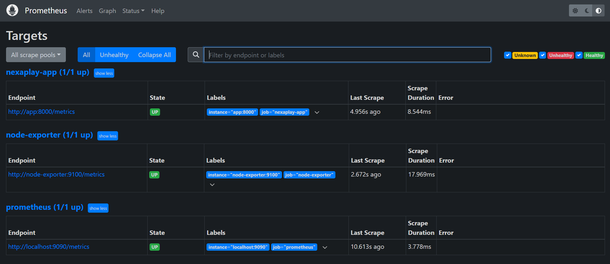

- `http://localhost:3000` — Grafana dashboard loading with all five panels

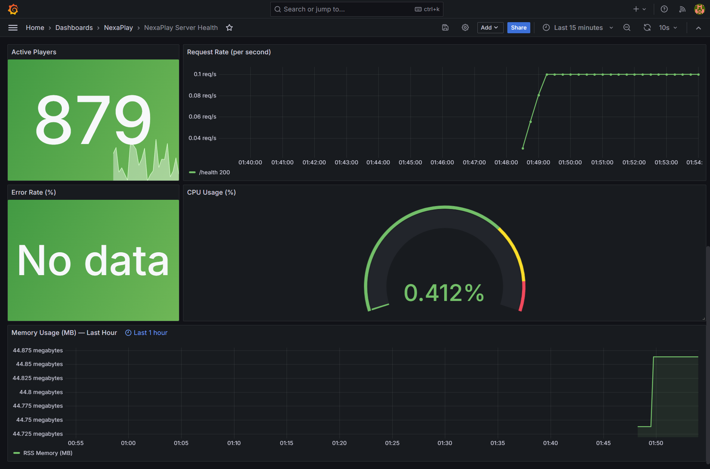

- `http://localhost:9090/alerts` — all alerts inactive

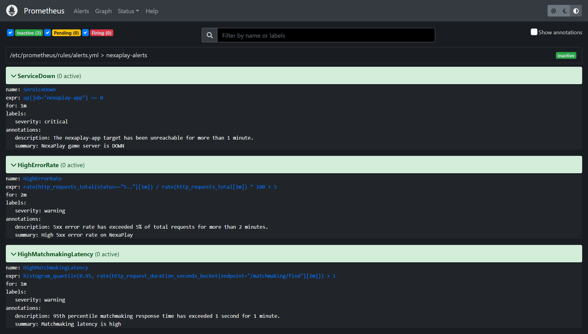

---

### Individual Reflection

#### How this stack addresses the five problems from Section 2.3

**Problem 1 — Players report outages before engineers know**

The `ServiceDown` alert fires within 1 minute of the app becoming unreachable. The `HighErrorRate` alert fires within 2 minutes of error rate exceeding 5%. In both cases, Alertmanager delivers a notification to the configured receiver (webhook, Slack, PagerDuty) before any player has time to post on Discord. The Eid al-Fitr incident took 24 minutes to reach Tunde via WhatsApp. With this stack, the on-call engineer would have been paged within 2 minutes.

**Problem 2 — No automated alerts**

Three alert rules now cover the three most likely failure modes: total service unavailability (`ServiceDown`), application-level errors (`HighErrorRate`), and performance degradation (`HighMatchmakingLatency`). Each rule has a tuned `for` duration to filter out transient blips — 1 minute for `ServiceDown`, 2 minutes for `HighErrorRate`, 1 minute for `HighMatchmakingLatency`. Alertmanager handles routing, grouping, and the `resolved` notification so the on-call engineer knows when the incident is over, not just when it starts.

**Problem 3 — No dashboards**

The five-panel Grafana dashboard gives a single-screen view of platform health: active player count, request throughput by endpoint and status, error rate percentage, CPU utilisation, and memory usage over the last hour. During the incident simulation, the dashboard showed the failure within seconds — Active Players dropped to red, Error Rate jumped to 100%, and a new `/matchmaking/find 500` series appeared in the Request Rate panel. No SSH, no log tailing, no guesswork.

**Problem 4 — Logs disappear when containers restart**

This is the one problem the current stack does not fully solve. Prometheus metrics survive a container restart because they are stored in the `prometheus-data` named volume. But application logs are still lost when the `nexaplay-app` container restarts. The correct fix is a log aggregation layer — Loki + Promtail, or shipping logs to CloudWatch — which is outside the scope of this project. The runbook partially mitigates this by instructing responders to save logs to a file (`docker compose logs --tail=200 app > /tmp/app-errors.txt`) before restarting.

**Problem 5 — No record of what normal looks like**

Prometheus stores time-series data in the `prometheus-data` volume with a default 15-day retention window. After running the load generator for 5 minutes before the incident, the dashboard had a clear baseline: ~1,003 active players, ~2.5 req/s, 0% error rate, ~45.2 MB memory. When the incident fired, the deviation from that baseline was immediately visible. The memory panel's 1-hour time window was specifically designed for this — it shows the trend, not just the current value, so a slow memory leak would be visible as a rising slope before it causes a crash.

---

#### What was the hardest part

The hardest part was the **Alertmanager `envsubst` templating pattern** from Week 1. It required understanding three separate systems simultaneously: how Docker `ENTRYPOINT` works, how `envsubst` substitutes environment variables into files at runtime, and how `docker-compose.yml` passes `.env` values into the container environment. Getting the order of operations wrong — Alertmanager starting before `envsubst` finishes, or the variable not being exported into the container's environment — would produce a silently broken config with a literal `${ALERTMANAGER_WEBHOOK_URL}` string as the webhook URL, which would fail with no obvious error message.

The second hardest part was the **GitHub Actions workflow**. Two separate failures had to be debugged without being able to run the workflow locally: the `docker-compose-plugin` apt package not being available on `ubuntu-latest`, and the Prometheus image's default entrypoint overriding the `promtool` command. Both required reading the error output carefully and understanding how Docker image entrypoints work.

---

#### What I would improve

**1. Add log persistence.** The biggest gap in the current stack is that application logs vanish on container restart. Adding Loki and alloy would give the same time-series query experience for logs that Prometheus gives for metrics — and would have made the incident investigation faster by letting me correlate log lines with the metric spikes on the dashboard.

**2. Shorten the `HighErrorRate` `for` duration.** The current 2-minute window means the alert fires 2 minutes after errors start. During the incident simulation, the error rate hit 100% within seconds of the trigger. A `for: 30s` duration would page the on-call engineer faster at the cost of slightly more false positives from brief spikes — a worthwhile trade-off for a critical player-facing service.

**3. Add a `HighMatchmakingLatency` panel to the dashboard.** The current dashboard has no latency time series — only the alert rule tracks p95 latency. Adding a panel with `histogram_quantile(0.95, rate(http_request_duration_seconds_bucket{endpoint="/matchmaking/find"}[2m]))` would make latency degradation visible before the alert fires, giving the on-call engineer earlier warning and a graph to include in the incident report.

**4. Automate the S3 export in CI.** The `scripts/export_to_s3.py` script currently has to be run manually. Adding it as a step in the GitHub Actions workflow — triggered only on pushes to `master` that modify the dashboard JSON — would ensure the S3 backup is always in sync with the repository without any manual intervention.
