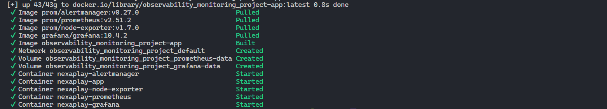
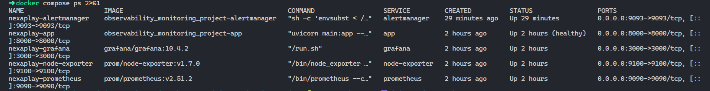
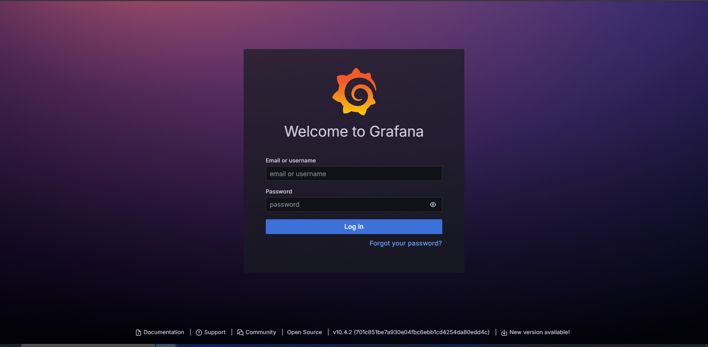
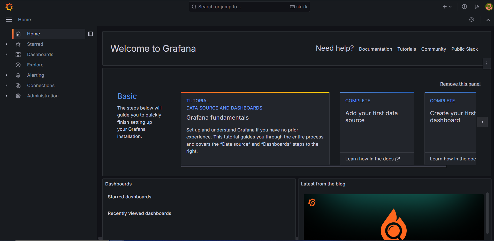
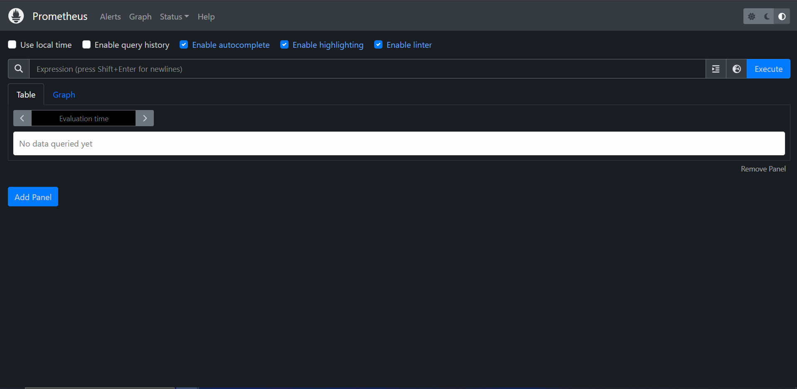

# NexaPlay Observability & Monitoring Project — Daily Journal

This document contains daily accomplishments.

---

## Day 1: Setting Up Tools

**What I did today:**

Tools including `Docker Desktop, Git, VS Code, Python 3.11, AWS CLI v2` were setup. These are confirmed by running the `powershell script` below:

```ps
.\check-versions.ps1
```

**Output**:

```sh
Docker Desktop: Docker version 29.4.0
Git: git version 2.52.0.windows.1
VS Code: 
Python: Python 3.13.12
AWS CLI v2: aws-cli/2.34.20 Python/3.14.3 Windows/11 exe/AMD64
```

Also, the following files were created as part of the requirements:

- `app/Dockerfile`: builds the FastAPI app on Python 3.11-slim.
- `docker-compose.yml`: all 5 services (app, prometheus, alertmanager, node-exporter, grafana) with health checks, named volumes, and env var wiring.
- `prometheus.yml`: scrapes app, node-exporter, and itself every 15s; points to Alertmanager
- `alerts.yml`: 3 rules: ServiceDown, HighErrorRate, HighMatchmakingLatency
- `alertmanager.yml.tmpl`: routes all alerts to webhook receiver; URL pulled from .env. I am using this template file to avoid hardcoding the `Webhook url`. Hence, using a custom `Dockerfile` for `Alertmanager` that's based on `Alpine`, which includes envsubst, and uses it as the entrypoint. Here's the setup:

1. alertmanager/Dockerfile — uses Alpine-based image that copies the Alertmanager binary from the official image, installs gettext (which provides envsubst), and uses it as the entrypoint to render the template before starting alertmanager.yml.tmpl.
2. the template with ${ALERTMANAGER_WEBHOOK_URL} as a real placeholder. Alertmanager now uses build: ./alertmanager and passes ALERTMANAGER_WEBHOOK_URL from .env as an environment variable. This makes it `dynamic and production grade`. This is because the `Webhook URL` lives in .env (one place), the template is version-controlled without secrets, and any team member cloning the repo just sets their own URL in .env and runs docker compose up --build — no manual editing of config files needed.

    > Note: running `docker compose up -d` for this set up might fail. The default build command is:

    ```sh
    docker compose up --build
    ```

    

    

- `prometheus.yml`: auto-wires Prometheus as default datasource
- `dashboard-provider.yml`: loads dashboards from the dashboards folder
- `nexaplay-overview.json`: 7 panels covering active players, matchmaking queue, request rate, error rate, response time (p50/p95), CPU, and memory

**Grafana** and **prometheus** are now accessible via localhost:3000 and localhost:9090 respectively.






AWS CLI configured, confirmed by running:

```sh
aws sts get-caller-identity
```

**Output**:

```sh
{
    "UserId": "MyUserID",
    "Account": "xxxxxxxxxxxxxxx",
    "Arn": "arn:aws:iam::xxxxxxxxxxxxxxx:user/myuser"
}
```

---

## Day 2: Setup Prometheus & Metrics

---

<!-- Add one entry every day through to Day 10 -->