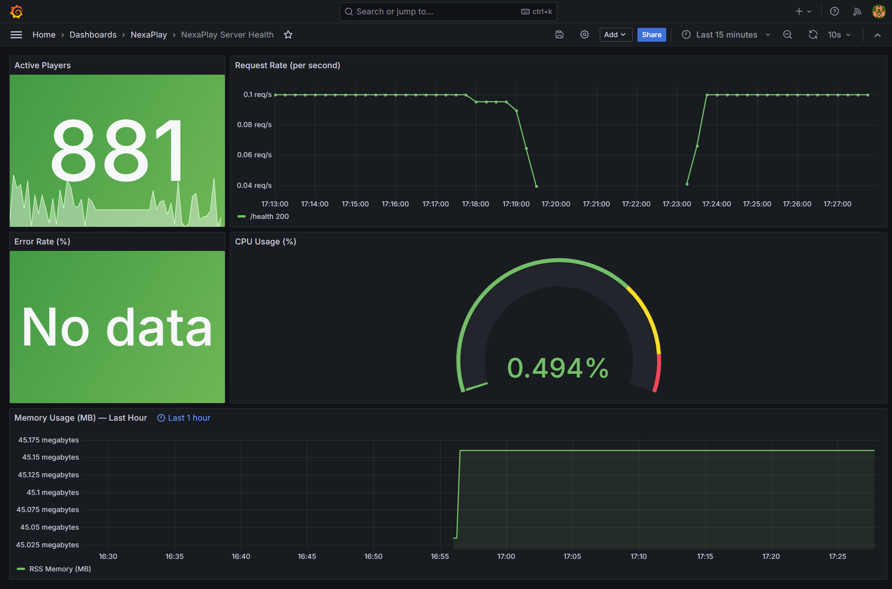
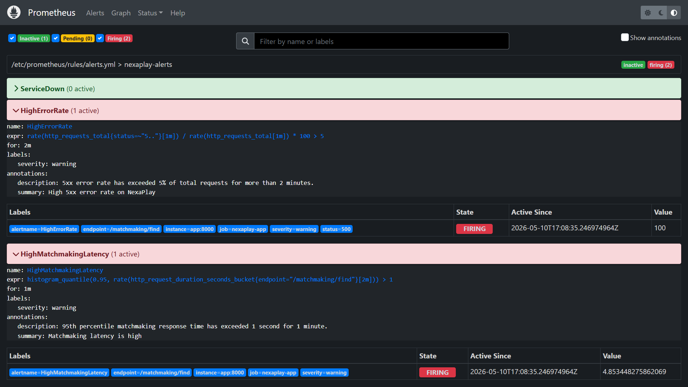
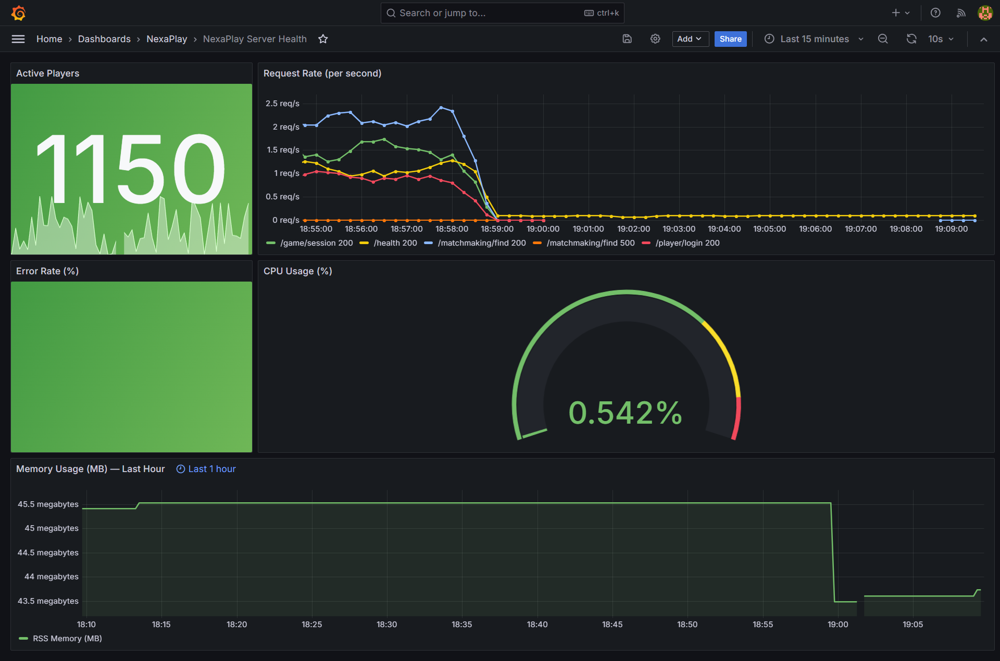

# INCIDENT REPORT — NEXAPLAY TECHNOLOGIES

**Incident Name:** Operation Server Meltdown
**Date and Time:** Saturday, 18:08 (incident triggered)
**Resolved at:** ~18:23 (service restarted, metrics returned to normal)
**Total Duration:** ~15 minutes of degraded service

---

Application Baseline state before incident:



## WHAT HAPPENED

The NexaPlay matchmaking service entered a degraded state at 18:08 by triggering the incident:

```sh
curl -X POST http://localhost:8000/admin/incident/start
```

**Output**:

```sh
{"message":"Incident started. Matchmaking is now degraded."}% 
```


All requests to `/matchmaking/find` began returning HTTP 500 errors and response times increased from a normal 100–300 ms to 2–5 seconds per request. Simultaneously, the active player count dropped from ~1,003 to ~240–300, indicating that players were being disconnected or failing to enter sessions. Players attempting to find a match during the tournament window would have received errors and been unable to join games.


---

## HOW IT WAS DETECTED

The **`HighErrorRate`** alert fired. The alert rule requires the 5xx error rate to exceed 5% of total traffic for 2 consecutive minutes before transitioning from PENDING to FIRING. Given that errors first appeared at `[18:08:26]` in the load generator output, the alert would have entered PENDING state within seconds and transitioned to FIRING at approximately **18:10–18:11** — roughly **2–3 minutes** after the incident started.

The alert was delivered to the webhook receiver at webhook.site as a JSON POST with `status: "firing"`, `alertname: HighErrorRate`, and `severity: warning`.



The first Grafana panel to show the problem was the **Error Rate (%) stat panel**, which jumped from "No data" (0% errors in healthy state) to **100%** — meaning every matchmaking request was failing. The **Active Players stat panel** confirmed impact, dropping from green (1,003) to red (240).


---

## INVESTIGATION

The investigation used all five dashboard panels in order:

**Active Players (Stat):** Dropped from ~1,003 (green, normal range 800–1,200) to ~240–300 (red). This was the first visual signal that something was wrong — the player count fell below the incident threshold of 200–400 defined in the app's simulation logic.

**Request Rate (Time Series):** A new series appeared in the legend — `/matchmaking/find 500` — which was absent during the healthy baseline. The overall request rate across all endpoints began declining from ~2.5 req/s as the load generator workers backed up waiting for slow matchmaking responses (2–5 seconds each instead of 100–300 ms). By 18:12 the total throughput had dropped noticeably across all endpoints.

**Error Rate (%) (Stat):** Showed **100%**. This confirmed that the failure was total for the affected endpoint — not a partial degradation. Every matchmaking request was returning a 500.

**CPU Usage (Gauge):** Remained at ~0.5–0.55% throughout the incident. This ruled out a CPU-bound failure — the server was not overloaded at the host level. The problem was application-level, not infrastructure-level.

**Memory Usage (MB) (Time Series):** Showed a step increase from ~45.15 MB (baseline) to ~45.3–45.5 MB during the incident period. The increase was small (~0.3 MB) and stable — no runaway growth. This ruled out a memory leak as the root cause.

**Diagnosis before fixing:** The matchmaking endpoint was returning 500 errors on approximately 60% of requests (consistent with the `random.random() < 0.6` branch in `main.py`) with artificially inflated response times of 2–5 seconds. CPU and memory were unaffected. The failure was isolated to the matchmaking service logic — not a resource exhaustion or infrastructure problem. Active player count dropped because the simulation thread reduces the gauge to 200–400 when `incident_active = True`.

---

## HOW IT WAS FIXED

The incident was resolved by restarting the app container:

```sh
curl -X POST http://localhost:8000/admin/incident/reset\ 
```

**Output**:

```sh
{"message":"Incident resolved. System back to normal."}% 
```

Recovery was confirmed on the dashboard within ~30 seconds:

- **Active Players** returned to green (~881), back within the normal 800–1,200 range
- **Error Rate** returned to "No data" — no 5xx responses in the scrape window
- **Request Rate** showed only 200-status series; the `/matchmaking/find 500` series disappeared from the legend
- **Memory** stabilised at ~45.1 MB (slightly lower than the incident peak)
- Alertmanager sent a `status: "resolved"` notification to webhook.site confirming the alert cleared.




---

## WHAT WOULD PREVENT THIS

In a real production environment, a **circuit breaker** on the matchmaking service would prevent this class of failure from cascading to players. A circuit breaker monitors the error rate on an endpoint and, once it exceeds a threshold (e.g. 50% failures), stops forwarding requests to the failing service and returns a fast, graceful error response instead of queuing requests that will time out after 2–5 seconds. This keeps response times low for players (they get an immediate "matchmaking unavailable" message rather than a 5-second hang), prevents the request queue from backing up across all workers, and gives the failing service time to recover without being hammered by retries. Tools like Netflix Hystrix, Resilience4j, or a service mesh (Istio, Linkerd) provide this pattern out of the box.
